<div align="center">

# 🧠 StreamSense

### Multi-Device Physiological Recording Platform

*Synchronized recording and analysis of physiological signals from multiple devices*

[](https://www.python.org/downloads/)
[](https://github.com/siddhant61/StreamSense)
[](LICENSE)
[](https://labstreaminglayer.readthedocs.io/)

[Features](#-features) •
[Screenshots](#-screenshots) •
[Quick Start](#-quick-start) •
[Documentation](#-documentation) •
[Architecture](#-architecture)

</div>

---

## 📖 Overview

**StreamSense** is a professional multi-device physiological recording platform designed for social neuroscience research. It enables synchronized data acquisition from multiple participants and devices simultaneously, with microsecond-precision timestamps for accurate cross-device correlation analysis.

### Key Capabilities

- 🔗 **Multi-Device Synchronization** - Record from multiple people simultaneously with LSL timestamps
- 🎯 **Multi-Vendor Support** - Muse (EEG), Empatica E4 (wrist), BITalino (multi-sensor)
- 💻 **Professional UI** - Beautiful PyQt5 dashboard for easy device management
- 📊 **Real-Time Streaming** - Live LSL stream monitoring and visualization
- 🔄 **Robust Architecture** - Process-based isolation, automatic reconnection, crash recovery
- 📈 **Analysis-Ready Output** - MNE format for EEG, pandas DataFrames for other signals

### Use Cases

- 👥 **Social Neuroscience** - Measure physiological synchrony between people (couples, teams, groups)
- 🧘 **Meditation Research** - Multi-person brain synchronization during meditation
- 🎵 **Music Studies** - Physiological coordination in musical ensembles
- 💑 **Relationship Research** - Heart rate and brain wave synchronization in couples
- 🏥 **Clinical Applications** - Multi-modal physiological monitoring

---

## ✨ Features

### Device Support

| Device | Sensors | Sampling Rates | Connection |
|--------|---------|----------------|------------|
| **Muse 2/S** | EEG (4ch), PPG, ACC, GYRO | 256Hz EEG, 64Hz PPG | Bluetooth LE |
| **Empatica E4** | BVP, GSR, TEMP, ACC | 64Hz BVP, 4Hz GSR | WiFi/BLE Server |
| **BITalino** | ECG, EDA, EMG, EEG, ACC | Up to 1000Hz | Bluetooth/Serial |

### Core Features

✅ **Professional UI Dashboard**
- Device discovery and management
- One-click connect/disconnect
- Real-time status monitoring
- Signal quality indicators
- Recording controls with live timer

✅ **Multi-Device Recording**
- Synchronized timestamps across all devices (LSL)
- Individual device processes for crash isolation
- Automatic reconnection with exponential backoff
- Intelligent data interpolation for brief disconnections

✅ **Lab Streaming Layer (LSL) Integration**
- Industry-standard protocol for physiological data
- Network time protocol synchronization (microsecond precision)
- Compatible with all major analysis tools (MNE, EEGLAB, etc.)
- XDF format for multi-stream recordings

✅ **Extensible Architecture**
- BaseStreamer abstract class for easy device addition
- Process-based isolation for reliability
- Clean MVC pattern (UI ↔ Controller ↔ Core)
- Comprehensive documentation and guides

---

## 📸 Screenshots

### Professional UI Dashboard
*Beautiful dark-themed interface for device management and recording*

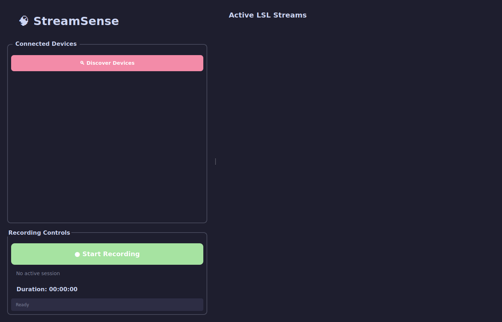
*Clean initial state ready for device discovery*

---

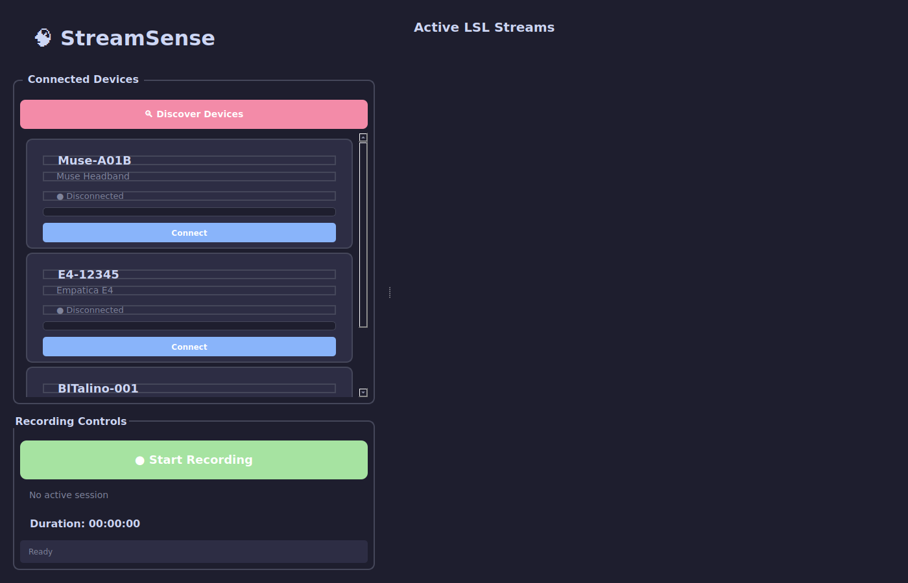
*Multiple devices discovered and ready to connect*

---

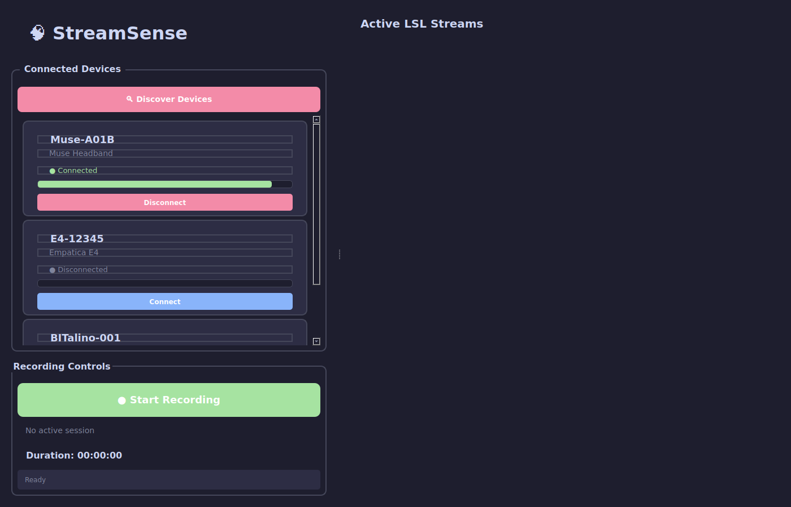
*Muse headband connected with signal quality indicator*

---

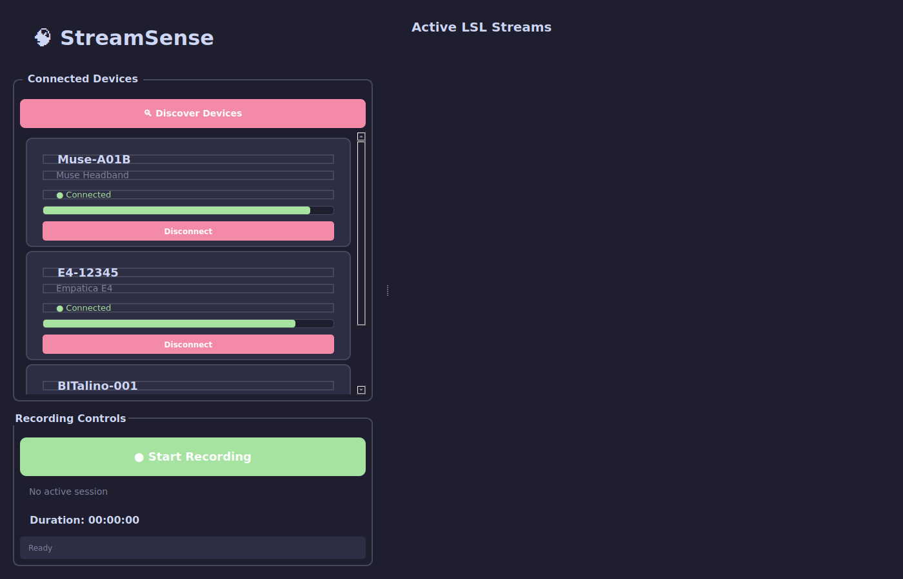
*Multiple devices streaming simultaneously*

---

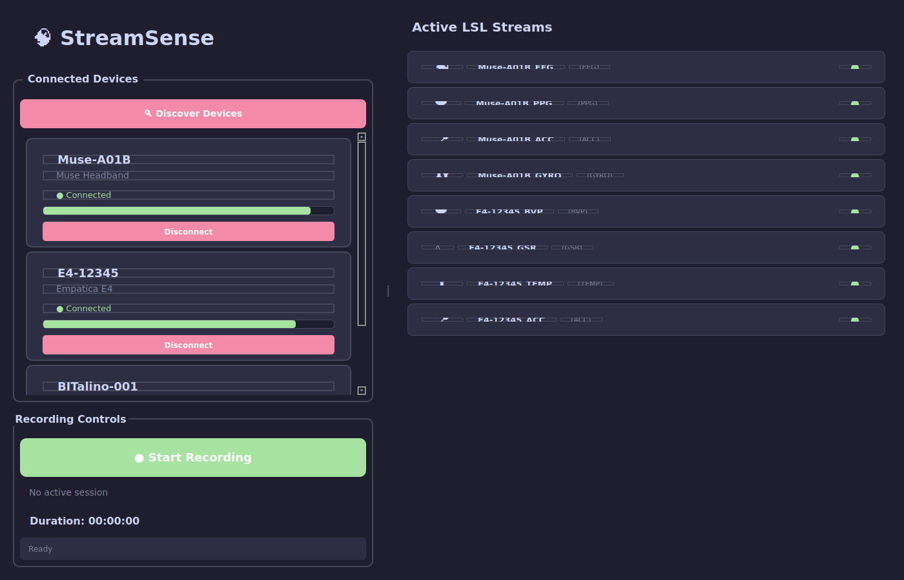
*Live LSL streams from all connected devices*

---

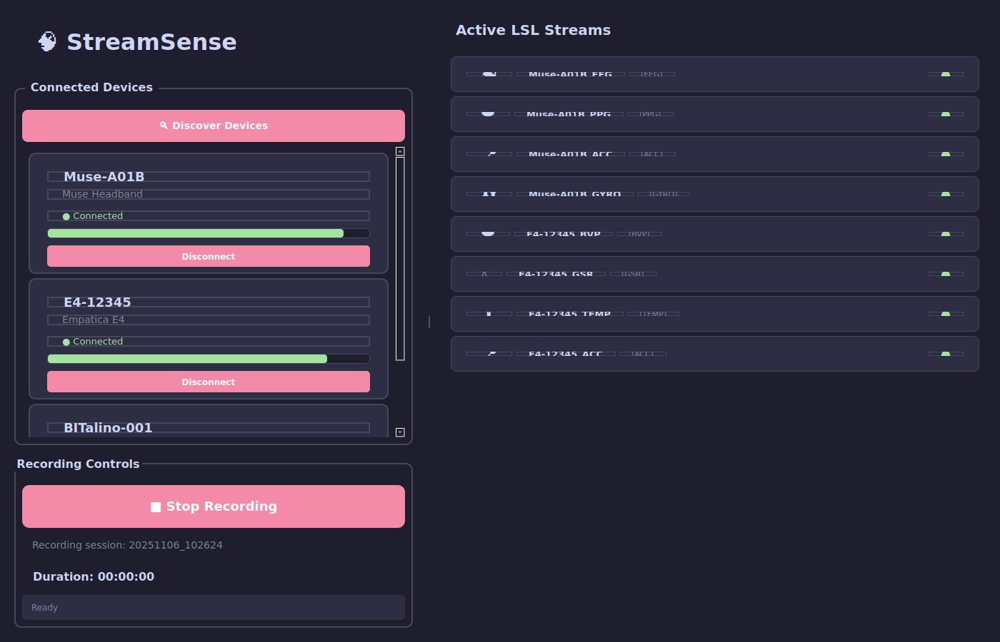
*Recording session in progress with live duration timer*

---

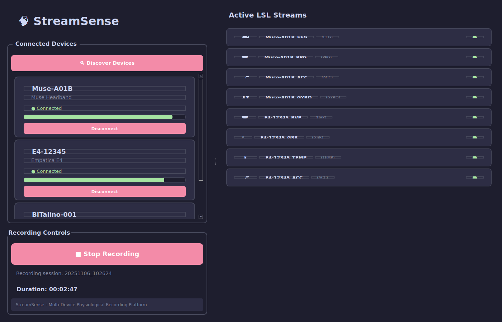
*Complete UI showing all features in action*

---

### System Architecture & Real Hardware

*How StreamSense works under the hood with actual devices*

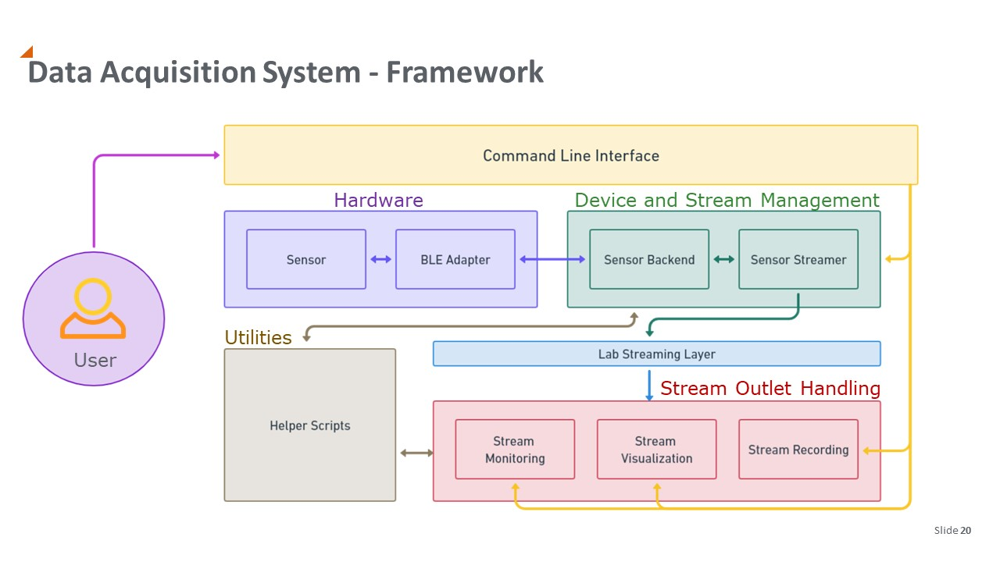
*Complete system architecture showing CLI, device integration, and LSL streaming pipeline*

---

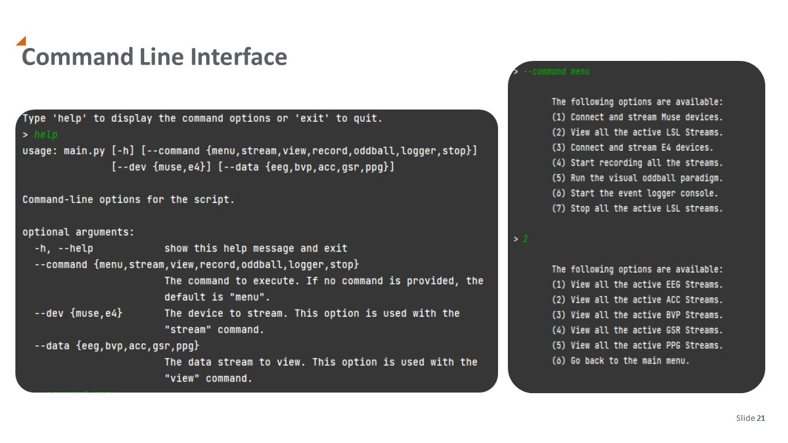
*Interactive command-line interface with menu-driven device control*

---

### Real Devices Streaming Live Data

*Actual Muse and E4 sensors connected and streaming physiological signals*

<table>
<tr>
<td width="50%">

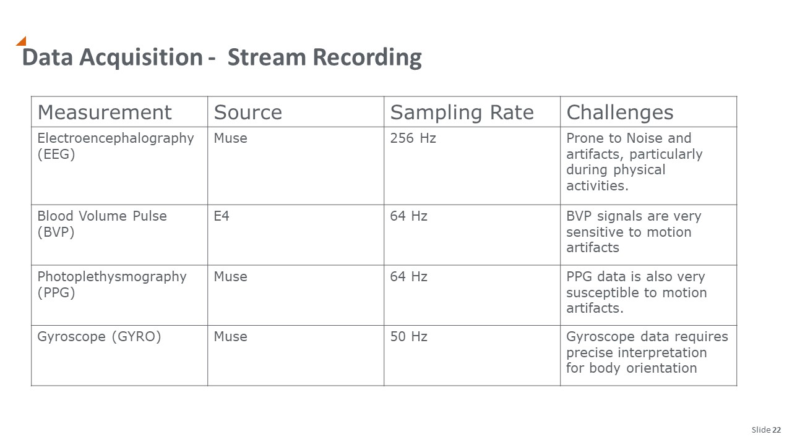
*Muse headband streaming EEG, PPG, accelerometer, and gyroscope data in real-time*

</td>
<td width="50%">

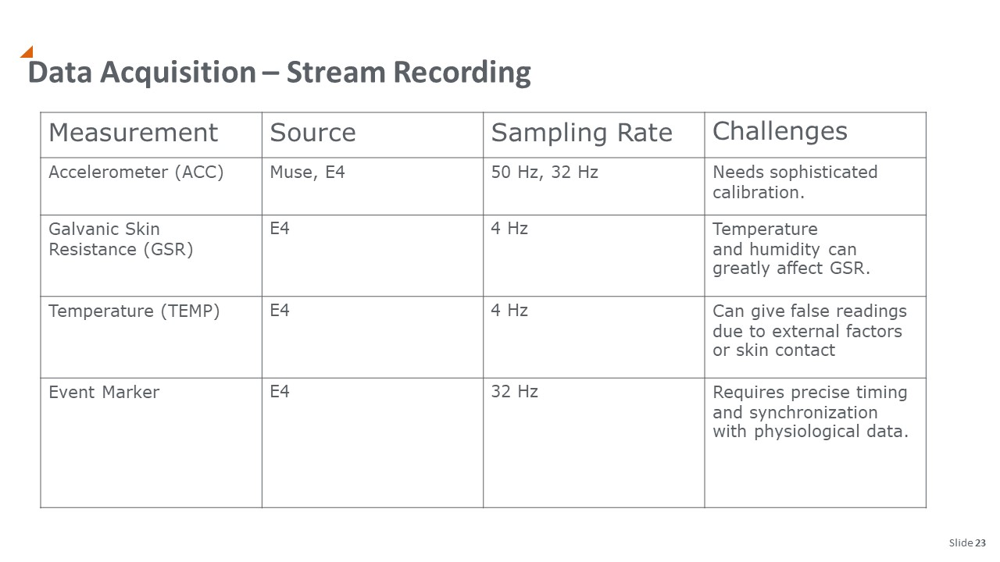
*Empatica E4 streaming BVP, GSR, temperature, and acceleration data simultaneously*

</td>
</tr>
</table>

---

### Real-Time Visualization

*Live signal monitoring and visualization during active recording sessions*

<table>
<tr>
<td width="50%">

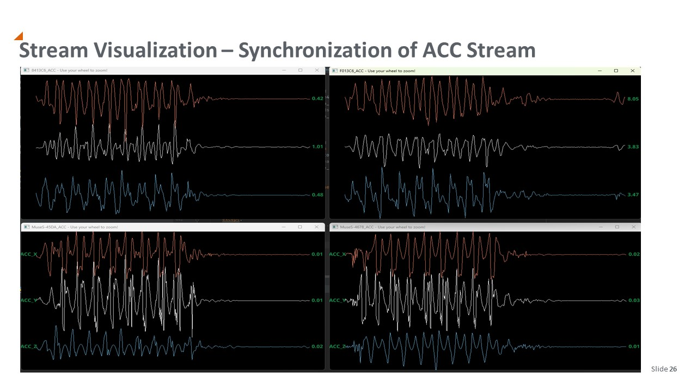
*Real-time EEG signal visualization with 4-channel brain activity monitoring*

</td>
<td width="50%">

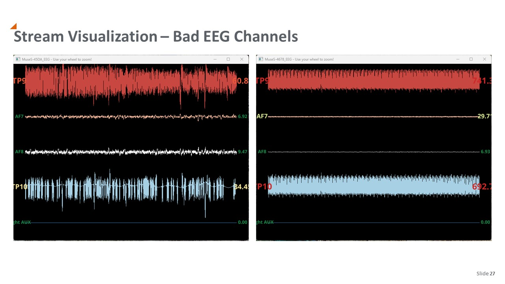
*Live PPG (heart rate) visualization showing cardiac pulse patterns*

</td>
</tr>
</table>

---

### Data Quality & Recording

*High-quality synchronized multi-device recordings ready for analysis*

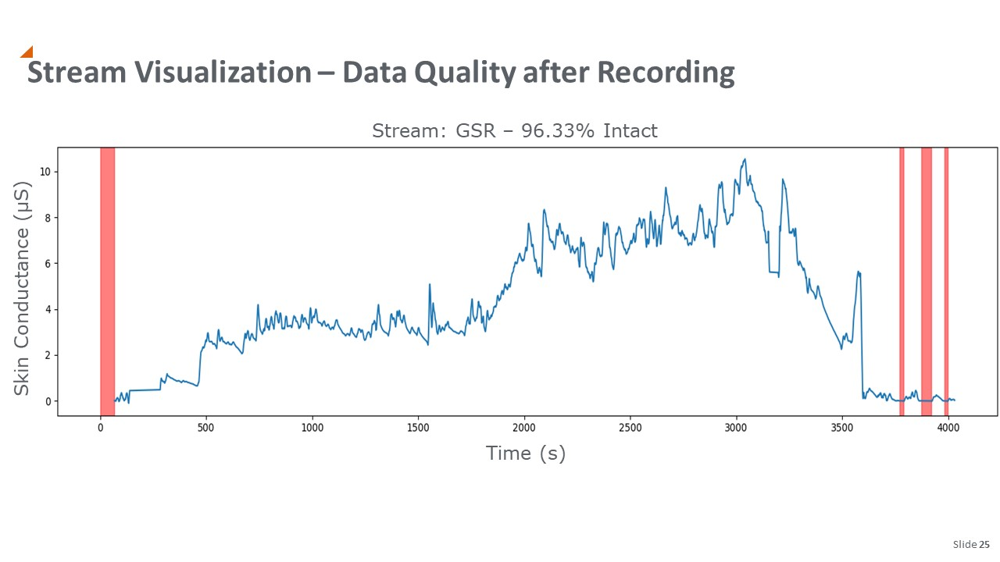
*Synchronized data streams from multiple sensors showing excellent signal quality and timestamp alignment*

---

## 🚀 Quick Start

### Installation

1. **Clone the repository**
   ```bash
   git clone https://github.com/siddhant61/StreamSense.git
   cd StreamSense
   ```

2. **Create Python environment** (Python 3.8+ required)
   ```bash
   python -m venv venv
   source venv/bin/activate  # On Windows: venv\Scripts\activate
   ```

3. **Install dependencies**
   ```bash
   pip install -r requirements.txt
   ```

### Launch the UI

```bash
python ui/streamsense_ui.py
```

### Basic Workflow

1. **Discover Devices** - Click "🔍 Discover Devices"
2. **Connect** - Click "Connect" on any device card
3. **Monitor Streams** - Watch live streams appear in the right panel
4. **Record** - Click "● Start Recording" to begin
5. **Stop** - Click "■ Stop Recording" when finished

**Output Location**: `Documents/StreamSense/[timestamp]/`
- `RawData/` - HDF5 files with raw sensor data
- `Dataset/` - Processed data (MNE format for EEG, pandas for others)

---

## 📚 Documentation

Comprehensive guides are available in the `docs/` directory:

- **[UI Quick Start Guide](docs/UI_QUICK_START.md)** - Step-by-step UI usage with job demo script
- **[Multi-Device Synchronization Guide](docs/MULTI_DEVICE_SYNCHRONIZATION_GUIDE.md)** - Analysis techniques for synchrony studies
- **[Device Support Roadmap](docs/DEVICE_SUPPORT_ROADMAP.md)** - Planned device expansions
- **[Concurrency Guidelines](CONCURRENCY_GUIDELINES.md)** - Architecture decisions and patterns
- **[BaseStreamer API](streamer/README.md)** - Adding new devices
- **[Dependency Management](DEPENDENCY_MANAGEMENT.md)** - Installation troubleshooting

---

## 🏗️ Architecture

### System Overview

```
┌─────────────────────────────────────────────────────────────┐
│                    StreamSense UI (PyQt5)                   │
│  ┌──────────────┐  ┌──────────────┐  ┌──────────────┐     │
│  │   Device     │  │   Recording  │  │   Stream     │     │
│  │   Controls   │  │   Controls   │  │   Monitor    │     │
│  └──────────────┘  └──────────────┘  └──────────────┘     │
└───────────────────────────┬─────────────────────────────────┘
                            │ Qt Signals/Slots
┌───────────────────────────▼─────────────────────────────────┐
│             StreamSenseController (Business Logic)          │
│  • Device Discovery  • Connection Management  • Recording   │
└───────────────────────────┬─────────────────────────────────┘
                            │ Direct API Calls
┌───────────────────────────▼─────────────────────────────────┐
│                    Core Components                          │
│  ┌──────────────┐  ┌──────────────┐  ┌──────────────┐     │
│  │  FindDevices │  │ BaseStreamer │  │StreamRecorder│     │
│  │   (Scanner)  │  │  (Abstract)  │  │   (LSL→HDF5) │     │
│  └──────────────┘  └──────────────┘  └──────────────┘     │
│         │                  │                    │           │
│         │        ┌─────────▼─────────┐         │           │
│         │        │    Streamers      │         │           │
│         │        ├───────────────────┤         │           │
│         │        │  StreamMuse       │         │           │
│         │        │  StreamE4         │         │           │
│         │        │  StreamBioTalino  │         │           │
│         │        └─────────┬─────────┘         │           │
└─────────┼──────────────────┼───────────────────┼───────────┘
          │                  │                   │
          │                  ▼                   │
          │      Lab Streaming Layer (LSL)      │
          │     Network Time Synchronization    │
          │                  │                   │
          │                  ▼                   ▼
          ▼         ┌────────────────┐  ┌────────────────┐
  ┌──────────────┐  │  Muse Devices  │  │ XDF Recordings │
  │   Empatica   │  │  E4 Devices    │  │ HDF5 Raw Data  │
  │  BLE Server  │  │  BITalino      │  │ Pickle Datasets│
  └──────────────┘  └────────────────┘  └────────────────┘
```

### Key Design Patterns

**1. BaseStreamer Architecture**
- Abstract base class for all device streamers
- Process-based isolation (multiprocessing.Process)
- Standardized lifecycle: start → stream → stop
- Event-based synchronization (multiprocessing.Event)

**2. MVC Pattern**
- **View**: PyQt5 UI (`streamsense_ui.py`)
- **Controller**: Business logic (`streamsense_controller.py`)
- **Model**: Core components (streamers, recorder, finder)

**3. Thread Safety**
- Qt signals for cross-thread communication
- Background threads for blocking operations (discovery, connection)
- Main thread reserved for UI updates

**4. Process Isolation**
- Each device runs in separate Process
- Crash in one device doesn't affect others
- True parallelism for CPU-intensive operations

---

## 💻 Command-Line Interface

For advanced users, StreamSense also provides a powerful CLI:

```bash
python main.py
```

### CLI Commands

```bash
> menu          # Interactive menu mode
> stream --dev muse   # Stream from Muse devices
> stream --dev e4     # Stream from E4 devices
> view --data eeg     # View EEG streams
> record              # Start recording
> stop                # Stop all streams
```

**Menu Options:**
1. Connect and stream Muse devices
2. View all active LSL streams
3. Connect and stream E4 devices
4. Start recording all streams
5. Run visual oddball paradigm
6. Start event logger console
7. Stop all active LSL streams

---

## 🔬 Research Applications

### Example: Measuring Couple's Heart Synchrony

```python
import pyxdf
import numpy as np
from scipy import signal

# Load synchronized recording
streams, header = pyxdf.load_xdf('recording.xdf')

# Extract PPG for both participants
participant_a = [s for s in streams if 'Muse-A_PPG' in s['info']['name'][0]][0]
participant_b = [s for s in streams if 'Muse-B_PPG' in s['info']['name'][0]][0]

# Compute cross-correlation
correlation = signal.correlate(ppg_a, ppg_b, mode='full')
lags = signal.correlation_lags(len(ppg_a), len(ppg_b), mode='full')

# Find peak synchrony
peak_lag = lags[np.argmax(correlation)]
print(f"Peak synchrony at lag: {peak_lag} samples ({peak_lag/64:.2f} seconds)")
```

See [`docs/MULTI_DEVICE_SYNCHRONIZATION_GUIDE.md`](docs/MULTI_DEVICE_SYNCHRONIZATION_GUIDE.md) for complete examples.

---

## 🛠️ Platform Support

| Platform | Status | Notes |
|----------|--------|-------|
| **Windows 10/11** | ✅ Full Support | All features available |
| **macOS** | ⚠️ Partial | UI works, some device drivers limited |
| **Linux** | ⚠️ Partial | UI works, E4 server not available |

### Platform-Specific Requirements

**Windows:**
- Empatica BLE Server (for E4 devices)
- BLED112 dongle drivers (for Muse devices)

**macOS/Linux:**
- Core UI and recording features work
- Muse support via native Bluetooth LE
- E4 requires Windows or virtual machine

---

## 📦 Repository Structure

```
StreamSense/
├── ui/                          # Professional UI dashboard
│   ├── streamsense_ui.py       # PyQt5 interface
│   └── streamsense_controller.py  # Backend controller
├── streamer/                    # Device streamers
│   ├── base_streamer.py        # Abstract base class
│   ├── stream_muse.py          # Muse headband streamer
│   ├── stream_e4.py            # Empatica E4 streamer
│   └── stream_bitalino.py      # BITalino streamer
├── recorder/                    # Recording logic
│   └── stream_recorder.py      # LSL → HDF5 recorder
├── helper/                      # Utilities
│   ├── find_devices.py         # Device discovery
│   └── e4_helper.py            # E4-specific helpers
├── viewer/                      # Stream visualization
│   └── view_streams.py         # Vispy-based viewer
├── experiments/                 # Experimental protocols
│   └── visual_oddball.py       # Visual oddball paradigm
├── docs/                        # Documentation
│   ├── UI_QUICK_START.md       # UI usage guide
│   ├── MULTI_DEVICE_SYNCHRONIZATION_GUIDE.md
│   ├── DEVICE_SUPPORT_ROADMAP.md
│   └── screenshots/            # UI screenshots
├── tests/                       # Test suite
├── audit/                       # Architecture analysis
├── main.py                      # CLI entry point
└── requirements.txt             # Dependencies
```

---

## 🧪 Development

### Running Tests

```bash
pytest
```

Current test coverage:
- ✅ BaseStreamer lifecycle (21 tests)
- ✅ Muse streaming (8 tests)
- ✅ E4 streaming (19 tests)
- ✅ Data processing utilities

### Adding New Devices

StreamSense makes it easy to add new devices:

1. **Inherit from BaseStreamer**
   ```python
   from streamer.base_streamer import BaseStreamer

   class StreamMyDevice(BaseStreamer):
       def __init__(self, device_id, synchronized_start_time, root_output_folder):
           super().__init__(
               device_name=f"MyDevice_{device_id}",
               synchronized_start_time=synchronized_start_time,
               root_output_folder=root_output_folder
           )

       def _stream_wrapper(self):
           # Main streaming logic
           pass

       def _setup_lsl_outlets(self):
           # Create LSL outlets
           pass
   ```

2. **Implement streaming logic** - Connect to device, read samples, push to LSL
3. **Add to controller** - Update `streamsense_controller.py` discovery and connection
4. **Write tests** - Ensure reliability

See [`streamer/README.md`](streamer/README.md) for detailed guide.

---

## 🤝 Contributing

Contributions are welcome! Areas of interest:

- 🔌 **New device support** (Polar H10, Emotiv, OpenBCI, etc.)
- 📊 **Real-time visualization** (signal plots, synchrony graphs)
- 🧪 **Additional tests** (integration tests, UI tests)
- 📖 **Documentation** (tutorials, examples, translations)
- 🐛 **Bug fixes** (especially cross-platform issues)

**How to contribute:**
1. Fork the repository
2. Create a feature branch (`git checkout -b feature/amazing-feature`)
3. Commit your changes (`git commit -m 'Add amazing feature'`)
4. Push to the branch (`git push origin feature/amazing-feature`)
5. Open a Pull Request

---

## 📝 Citation

If you use StreamSense in your research, please cite:

```bibtex
@software{streamsense2025,
  title = {StreamSense: Multi-Device Physiological Recording Platform},
  author = {StreamSense Team},
  year = {2025},
  url = {https://github.com/siddhant61/StreamSense}
}
```

---

## 📄 License

This project is licensed under the MIT License - see the [LICENSE](LICENSE) file for details.

---

## 🙏 Acknowledgments

- **Lab Streaming Layer (LSL)** - Foundation for synchronized streaming
- **MNE-Python** - EEG analysis tools
- **PyQt5** - Professional UI framework
- **Muse LSL** - Muse device integration
- **Empatica** - E4 device support
- **BITalino** - Open-source biosignal platform

---

## 📬 Contact & Support

- **Issues**: [GitHub Issues](https://github.com/siddhant61/StreamSense/issues)
- **Discussions**: [GitHub Discussions](https://github.com/siddhant61/StreamSense/discussions)
- **Documentation**: [`docs/`](docs/)

---

<div align="center">

**Built with ❤️ for social neuroscience research**

⭐ **Star this repository** if you find it useful! ⭐

[⬆ Back to Top](#-streamsense)

</div>
