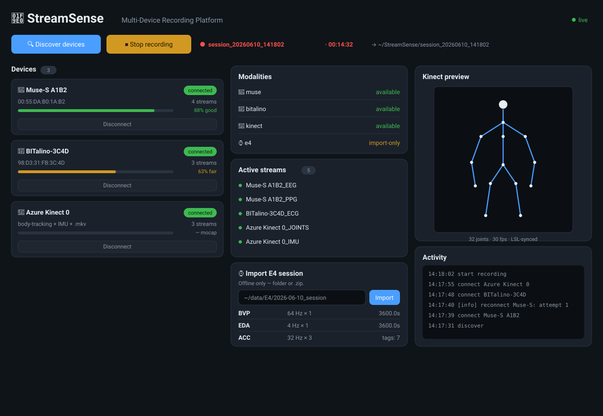
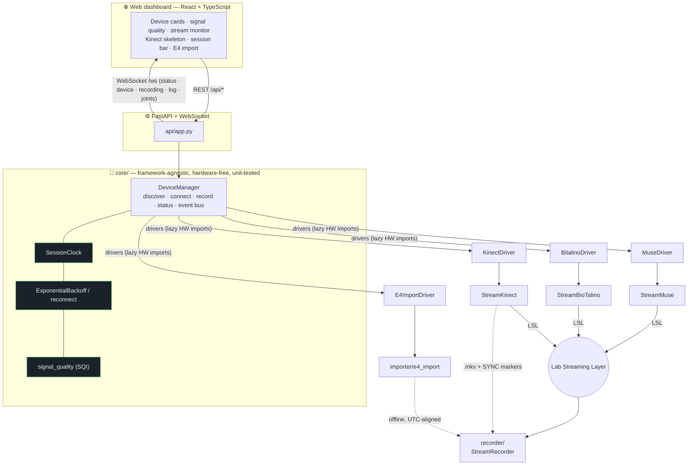

<div align="center">

# 🧠 StreamSense

### A unified web platform for synchronized multi-modal human-signal capture

*Brainwaves, body motion, and wearable biosignals — discovered, streamed, and recorded on one timeline, from one browser.*

[](https://www.python.org/)
[](https://fastapi.tiangolo.com/)
[](https://react.dev/)
[](https://labstreaminglayer.readthedocs.io/)
[](#-testing--ci)
[](LICENSE)

[Overview](#-overview) •
[Devices](#-supported-modalities) •
[Screens](#-the-dashboard) •
[Architecture](#-architecture) •
[Quick Start](#-quick-start) •
[Testing](#-testing--ci) •
[Roadmap](#-roadmap--future-direction)

</div>

---

## 📖 Overview

**StreamSense** turns a heterogeneous research rig — an EEG headband, a multi-sensor
biosignal board, a depth camera with body tracking, and a wrist wearable — into a single,
coherent recording system. Every live device publishes to the
[**Lab Streaming Layer (LSL)**](https://labstreaminglayer.readthedocs.io/) bus on one
synchronized clock, a recorder captures the session, and a modern web dashboard drives the
whole thing: discover → connect → monitor signal quality → record.

It is built as a **framework-agnostic core** (`DeviceManager` + device drivers, fully
unit-tested with **no hardware**) wrapped by a **FastAPI + WebSocket** API and a
**React + TypeScript** front end. Hardware SDKs are imported lazily, so the entire backend
and its ~190-test suite run green in a headless CI with no devices attached.

> **Why it exists.** Multi-person, multi-device physiological studies (social neuroscience,
> meditation, ensemble performance) need *time-aligned* data across vendors that don't talk
> to each other. StreamSense is the conductor that puts them on one timeline.

<div align="center">

<br><em>The operator dashboard: live device cards with real signal-quality, active streams, Kinect body preview, E4 import, and a recording session in progress.</em>
</div>

---

## 🎛 Supported modalities

| Modality | Device | Signals | Mode | Transport |
|---|---|---|---|---|
| 🧠 **EEG / PPG / motion** | **Muse S** | EEG ×4, PPG, ACC, GYRO | **live** | BLE → LSL |
| 💓 **Cardiac / EDA / EMG** | **BITalino** | ECG, EDA, EMG, ACC (≤1 kHz) | **live** | BLE / serial → LSL |
| 🎥 **Body motion + depth** | **Azure Kinect** | 32-joint skeleton + IMU → LSL; RGB-D → `.mkv` | **live** | `pyk4a` + Body Tracking SDK |
| ⌚ **Wrist biosignals** | **Empatica E4** | BVP, EDA, HR, IBI, TEMP, ACC, tags | **offline import** | E4 Connect archive |

> **An honest note on the E4.** Empatica withdrew the E4's real-time streaming server, so
> live E4 capture is no longer possible. StreamSense imports a recorded **E4 Connect
> session** (folder or `.zip`) and aligns it post-hoc by absolute UTC timestamps — the
> truthful path, surfaced clearly in the UI rather than pretended away.

---

## ✨ Features

- **One control surface** — discover, connect/disconnect, record, and monitor every device
  from a browser; live updates pushed over a WebSocket (no polling for status).
- **Real signal quality** — a genuine SQI (`0..1` → *good / fair / poor*, `null` when
  unknown) computed from the data (finite fraction, flatline/liveness, saturation headroom,
  sample-rate ratio). **No fabricated numbers.**
- **Kinect body preview** — the 32-joint skeleton rendered live on a canvas; RGB-D video is
  recorded to an `.mkv` sidecar with per-frame `SYNC` markers on the LSL clock for
  post-hoc alignment (video stays off the bus by design).
- **Synchronized acquisition** — a unified `SessionClock` gives every streamer one timebase;
  `multiprocessing`-isolated device workers; exponential-backoff reconnect.
- **Session recording** — LSL streams captured together with a live elapsed timer and output
  path; the Kinect `.mkv` lives alongside.
- **Offline E4 import** — parse an E4 Connect session into an aligned dataset, exposed via
  `POST /api/import/e4` and an Import panel (path confined to an allowlisted root).
- **Built to be trusted** — framework-agnostic core, lazy hardware imports, ~190 unit +
  integration tests, and CI on Python 3.11 / 3.12.

---

## 🏗 Architecture



**Design principle:** `core/` imports neither FastAPI nor any device SDK at module load.
Drivers import `muselsl` / `pygatt` / `bitalino` / `pyk4a` *inside* methods and report
`available()`, so the core and API import and test cleanly with zero hardware present.

---

## 🚀 Quick Start

**Requirements:** Python 3.11+ and Node 18+. (Live capture additionally needs the relevant
device SDKs/hardware; the platform runs and is fully testable without them.)

### 1 · Backend (FastAPI + WebSocket)

```bash
python -m pip install -r requirements-dev.txt      # API + test stack
uvicorn api.app:app --reload --port 8000
# REST at http://localhost:8000/api/*  ·  WebSocket at ws://localhost:8000/ws
```

### 2 · Frontend (Vite + React)

```bash
cd frontend
npm install
npm run dev        # http://localhost:5173  (proxies /api and /ws to :8000)
```

Open **http://localhost:5173**, hit **Discover devices**, connect, and record.

### Offline E4 import

```bash
# Confine server-side imports to a trusted base directory:
export STREAMSENSE_IMPORT_ROOT="$HOME/data"
curl -X POST localhost:8000/api/import/e4 -H 'Content-Type: application/json' \
     -d '{"path": "'"$HOME"'/data/E4/2026-06-10_session"}'
```

---

## 🧪 Testing & CI

The whole backend is verifiable headless — **no devices, no display**.

```bash
python -m pytest -m "not integration" --cov=core --cov=streamer   # unit + coverage
python -m pytest -m "integration"                                 # process-spawning
cd frontend && npm run build                                      # tsc (strict) + vite
```

- **~190 tests** across `core` (device manager, clock, backoff, SQI), the streamers
  (incl. mock-backend Kinect loop + sample shaping), the FastAPI REST/WebSocket surface,
  and the E4 importer (directory **and** `.zip`).
- **GitHub Actions** runs unit+coverage, integration pass/fail, and an advisory `pip-audit`
  on **Python 3.11 & 3.12** — invoked via `python -m pytest` so plugin loading is robust.
- An autouse fixture reaps stray `multiprocessing` workers so the suite always exits cleanly.

---

## 📁 Project structure

```
StreamSense/
├── core/              # framework-agnostic device manager (no HW/web imports)
│   ├── device_manager.py   # discover/connect/record/status + event bus
│   ├── drivers.py          # Muse · BITalino · Kinect · E4 (lazy HW imports)
│   ├── clock.py            # unified SessionClock
│   ├── backoff.py          # exponential backoff + reconnect
│   └── signal_quality.py   # real SQI (no fabricated values)
├── api/               # FastAPI app: REST /api/* + /ws WebSocket
├── streamer/          # BaseStreamer + Muse / BITalino / Kinect streamers
├── recorder/          # LSL session recorder
├── importer/          # Empatica E4 offline importer (E4 Connect → dataset)
├── frontend/          # Vite + React + TypeScript dashboard
│   └── src/components/     # DeviceCard · SignalQuality · StreamMonitor · SessionBar
│                           # SkeletonCanvas · ModalityPanel · ImportPanel · ActivityLog
├── tests/             # ~190 headless unit + integration tests
├── docs/              # design, synchronization guide, device roadmap, screenshots
└── .github/workflows/ # CI (pytest 3.11/3.12 + pip-audit)
```

📐 Full design notes: [`docs/PLATFORM_V2_DESIGN.md`](docs/PLATFORM_V2_DESIGN.md) ·
🔗 Sync model: [`docs/MULTI_DEVICE_SYNCHRONIZATION_GUIDE.md`](docs/MULTI_DEVICE_SYNCHRONIZATION_GUIDE.md)

---

## 🗺 Roadmap & future direction

**Shipped** ✅  Stabilized base · device-manager core + FastAPI/WS · Azure Kinect streamer ·
acquisition layer (clock + backoff + real SQI) · web dashboard · E4 offline importer.

**On-device verification** (hardware-bound — the code is structured and mock-tested, awaiting
a physical rig):
- [ ] Validate `PyK4ABackend` capture / `.mkv` recording / Body-Tracking-SDK joint shapes.
- [ ] Live Muse & BITalino connect/stream confirmation on real BLE hardware.
- [ ] E4 ↔ session fine time-offset calibration from a paired recording.

**Next features**
- [ ] Live **LSL → `joints`** forwarder to feed the skeleton preview with real capture data.
- [ ] **Session browser & export** — XDF export, per-session metadata, quick replay.
- [ ] **Real-time SQI streaming** to the UI from an LSL inlet (per-channel quality).
- [ ] More modalities behind the same driver interface (eye-tracking, ECG belts, audio).
- [ ] **Dockerized** one-command deploy; optional auth for remote/lab-network operation.
- [ ] Analysis notebooks (MNE / pandas) over recorded sessions.

---

## 🔬 Research context

StreamSense was built for **multi-person, multi-modal physiological research** — measuring
*synchrony* between people and signals:

- 👥 **Social neuroscience** — physiological coupling across participants
- 🧘 **Contemplative science** — multi-brain dynamics during shared meditation
- 🎶 **Ensemble performance** — coordination in musicians/dancers
- 💑 **Dyadic studies** — cardiac & neural alignment in pairs

---

## 📜 License

Released under the [MIT License](LICENSE).

## 🙏 Acknowledgments

Built on the shoulders of [Lab Streaming Layer](https://labstreaminglayer.readthedocs.io/),
[muse-lsl](https://github.com/alexandrebarachant/muse-lsl),
[pyk4a](https://github.com/etiennedub/pyk4a),
[BITalino](https://www.bitalino.com/),
[FastAPI](https://fastapi.tiangolo.com/), and [React](https://react.dev/).

<div align="center"><sub>Crafted with care for honest, reproducible science. 🌊</sub></div>
