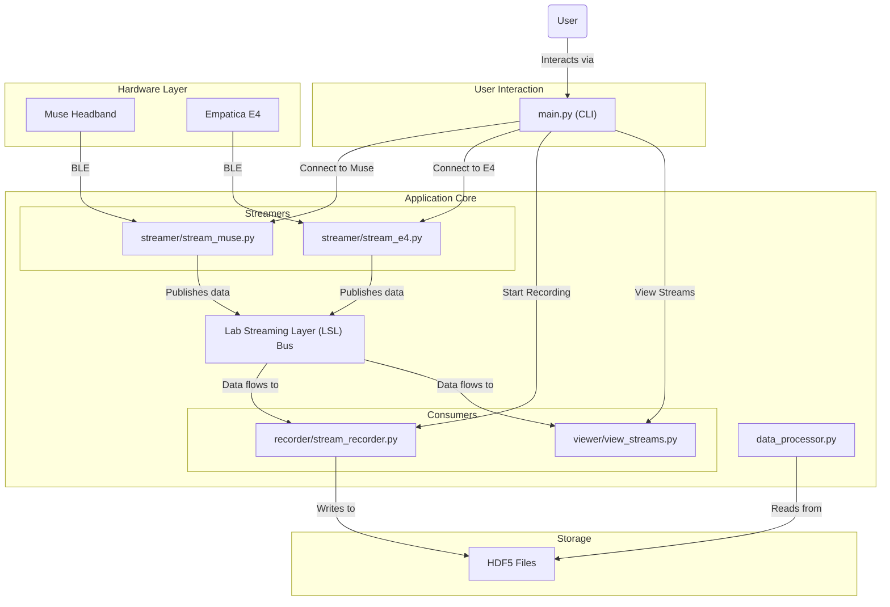

# Current Architecture Analysis

This document describes the current, de facto architecture of the StreamSense project as reconstructed from the source code.

## Architectural Pattern

The application is a **modular monolith**. It is a single, locally-run Python application, not a distributed system. Its components are organized into modules with distinct responsibilities, but they are all part of the same process or are spawned as sub-processes from a single main entry point.

## Key Components and Data Flow

The architecture is centered around the **Lab Streaming Layer (LSL)**, which acts as a real-time message bus for physiological data.

1.  **Entry Point (`main.py`)**:
    -   Serves as the **Command Line Interface (CLI)** for the user.
    -   Uses `argparse` to handle command-line arguments and provides an interactive menu.
    -   Orchestrates the entire application, initiating device connections, recording, and visualization based on user commands.

2.  **Device Connection & Streaming (`streamer/`, `helper/`)**:
    -   The `main.py` script calls modules like `streamer.stream_muse` and `helper.e4_helper` to establish connections with Muse and Empatica E4 devices.
    -   These modules handle the low-level Bluetooth (BLE) communication (`pygatt`, `pybluez`).
    -   Once connected, these modules continuously read data from the sensors and **publish** it to the LSL bus. Each data type (EEG, ACC, etc.) from each device is pushed to a unique LSL stream.

3.  **Data Consumption (`recorder/`, `viewer/`)**:
    -   **Recording (`recorder.stream_recorder.py`)**: This component runs in a separate thread and **subscribes** to all available LSL streams. It records the incoming data and timestamps, saving them into HDF5 files (`.h5`).
    -   **Visualization (`viewer.view_streams.py`, `viewer.plot_streams.py`)**: This component, when triggered by the user, subscribes to specific LSL streams. It uses `vispy` and `matplotlib` to create real-time plots of the data, allowing for live monitoring.

4.  **Offline Processing (`data_processor.py`)**:
    -   This is a standalone script, not directly part of the real-time pipeline.
    -   It is designed to be run after a recording session is complete.
    -   It reads the HDF5 files, performs data cleaning, gap detection, and quality analysis, and saves processed datasets and plots.

## Mermaid Diagram of Current Architecture

