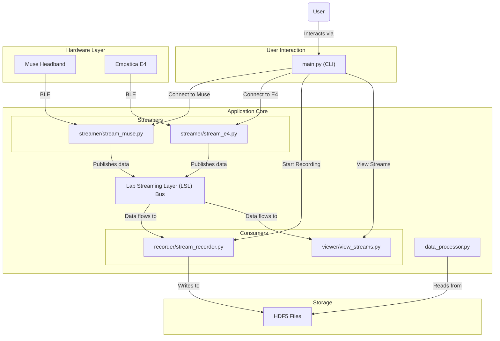

# Deliverable 2: Architecture Overview

This document provides a comprehensive overview of the StreamSense project's architecture, technology stack, and integration points. It covers both the intended design as described in the project's documentation and the actual, de facto architecture as determined by source code analysis.

---

## 1. Executive Summary: Intended vs. Actual Architecture

There is a significant gap between the project's intended architecture and its current state.

-   **Intended Architecture**: The project was envisioned as a well-documented, modular platform for physiological data acquisition. The documentation describes a clear set of features, a system architecture, and supporting materials like a `LICENSE` and `CONTRIBUTING.md`.
-   **Actual Architecture**: The implemented system is a functional but fragile modular monolith. While it follows the high-level data flow of the intended design (using LSL as a central bus), it is plagued by a lack of documentation, no dependency management, no tests, and fragile, complex code. Many documented features are either not integrated or exist as standalone, orphaned scripts.

The core discrepancy is one of **robustness and completeness**. The vision was for a stable, documented platform, but the reality is an unstable collection of scripts with significant technical debt.

---

## 2. Technology Stack

This section outlines the technology stack of the project as inferred from the source code analysis.

### 2.1. Programming Language

The primary programming language used in this project is **Python**.

### 2.2. External Libraries and Frameworks

The following is a comprehensive list of external Python libraries and frameworks that the project depends on. This list was generated by inspecting the `import` statements in all source files due to the absence of a `requirements.txt` or other dependency management file.

*   `psychopy`: For psychophysics experiments.
*   `numpy`: For numerical operations.
*   `userpaths`: For finding user-specific paths (e.g., My Documents).
*   `pylsl`: For Lab Streaming Layer (LSL) integration.
*   `muselsl`: A specific library for streaming data from Muse headbands.
*   `PyQt5`: A set of Python bindings for Qt application framework, likely used for GUI elements.
*   `seaborn`: A data visualization library based on matplotlib.
*   `mne`: For processing and analyzing neurophysiological data (EEG).
*   `vispy`: A high-performance interactive 2D/3D data visualization library.
*   `scipy`: For scientific and technical computing.
*   `h5py`: For interacting with HDF5 binary data format.
*   `pandas`: For data manipulation and analysis.
*   `matplotlib`: A comprehensive library for creating static, animated, and interactive visualizations.
*   `bitstring`: For parsing and manipulation of binary data.
*   `pygatt`: A Python wrapper for GATTtool for Bluetooth LE communication.
*   `pyserial`: For serial port communication.
*   `pybluez`: For Bluetooth communication.
*   `pywifi`: For WiFi device scanning.
*   `wmi`: A Python library for accessing WMI (Windows Management Instrumentation).

---

## 3. System Architecture Analysis

### 3.1. Intended System Architecture (from Documentation)

The system was designed around a modular framework, as depicted in the project's architecture diagram.

- **User Interface**: A Command Line Interface (CLI).
- **Hardware Layer**: Interfacing with Muse and E4 sensors via a BLE Adapter.
- **Core Backend**: A `Sensor Backend` and `Sensor Streamer` to manage the hardware and publish data to the Lab Streaming Layer (LSL).
- **Data Handling Layer**: `Stream Recording`, `Stream Visualization`, and `Stream Monitoring` components that consume data from LSL.
- **Utilities**: A collection of `Helper Scripts`.

### 3.2. Current System Architecture (from Code)

The actual architecture is a **modular monolith** centered around LSL.

-   **Entry Point (`main.py`)**: A CLI that orchestrates the application.
-   **Device Connection & Streaming (`streamer/`, `helper/`)**: Modules that connect to hardware and **publish** data to LSL.
-   **Data Consumption (`recorder/`, `viewer/`)**: Modules that **subscribe** to LSL for recording and visualization.
-   **Offline Processing (`data_processor.py`)**: A standalone script that reads recorded HDF5 files for analysis.

### 3.3. Mermaid Diagram of Current Architecture

---

## 4. Integration Point Analysis

### 4.1. Internal Integration: Lab Streaming Layer (LSL)

-   **Status**: `Needs Improvement (Technical Debt)`
-   **Assessment**: The use of LSL is architecturally sound, but the implementation is fragile. The system lacks robust error handling and state management, making it vulnerable to component failures.

### 4.2. External Integration: Hardware Devices

-   **Muse Headbands**:
    -   **Status**: `Needs Improvement (Technical Debt)`
    -   **Assessment**: The integration is overly complex, difficult to maintain, and relies on unreliable `time.sleep()` calls for synchronization.
-   **Empatica E4**:
    -   **Status**: `Needs Improvement (Technical Debt)`
    -   **Assessment**: This integration is fragile due to its dependency on a proprietary external executable and raw TCP socket communication. The implementation suffers from the same issues as the Muse integration.
