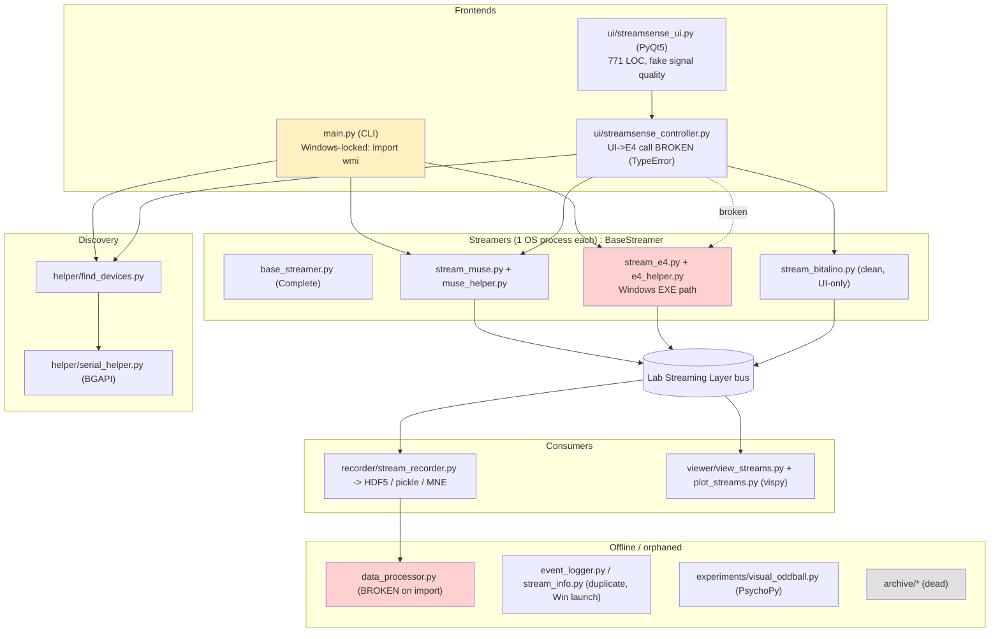
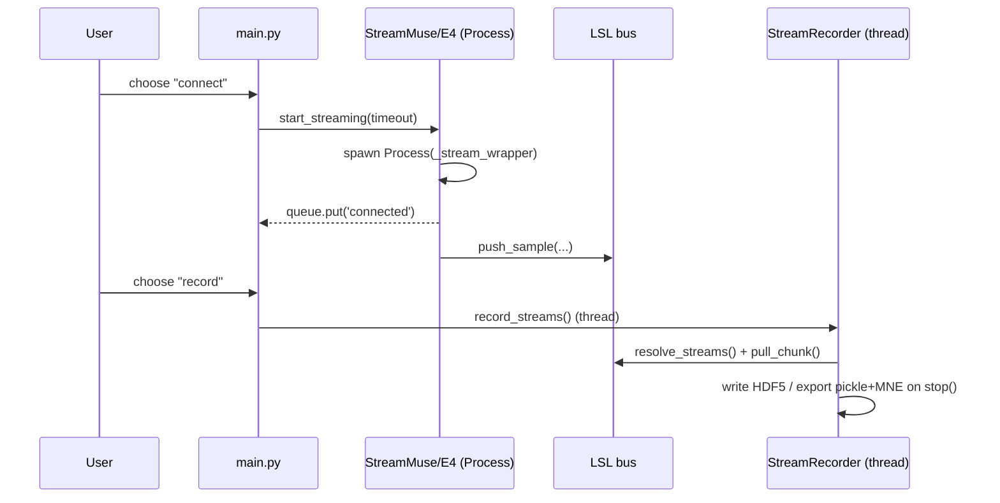

# Deliverable 2: Architecture Overview (Refreshed — 2026-05-28)

> This document **supersedes** the August-2025 version of this file and the November-2025
> comprehensive audit. It describes StreamSense as it exists on branch
> `claude/determined-gates-Zkfw7`, based on first-hand source analysis and a test run.

---

## 1. What StreamSense Is

StreamSense is a **Python desktop application** for synchronized, multi-device physiological
data acquisition (social-neuroscience research). It is **not** a web app: there is no HTTP API
or browser frontend. The "frontend" is a **PyQt5 desktop dashboard** plus a legacy **text CLI**;
the "backend" is a set of in-process Python modules that spawn one OS **process per device** and
publish data onto a **Lab Streaming Layer (LSL)** bus that a recorder subscribes to.

- **Language:** Python 3.8+ (developed/tested here on CPython 3.11.15)
- **Entry points:** `main.py` (CLI) and `ui/streamsense_ui.py` (PyQt5 GUI)
- **Devices:** Muse (EEG/PPG/ACC/GYRO), Empatica E4 (BVP/GSR/TEMP/ACC/IBI), BITalino (ECG/EDA/EMG/EEG/ACC)
- **Output formats:** HDF5 (raw, resizable datasets), pickle datasets, MNE `RawArray` for EEG, CSV experiment markers

---

## 2. Technology Stack

| Layer | Technology | Notes |
|-------|-----------|-------|
| GUI | PyQt5 | `ui/streamsense_ui.py` (771 LOC), QThread monitor |
| CLI | argparse + input loop | `main.py` (419 LOC) |
| Streaming bus | Lab Streaming Layer (`pylsl`) | central decoupling point; single point of failure |
| Device I/O | `pygatt`, `muselsl`, `pybluez`, `pyserial`, sockets, `bitalino` | BLE/serial/socket; several Windows-only paths |
| Concurrency | `multiprocessing` (process/device) + `threading` (in-process) | hybrid model; 41 `time.sleep()` sync points in core |
| Data/science | `numpy`, `pandas`, `scipy`, `h5py`, `mne` | recording + offline processing |
| Visualization | `vispy` (GLSL), `matplotlib`, `seaborn` | real-time + quality plots |
| Experiments | `psychopy` | visual oddball P300 |
| Platform glue | `wmi`, `pywifi`, `userpaths` | **`wmi` is Windows-only and imported unconditionally** |
| Test | `pytest`, `pytest-cov`, mock layer in `tests/mocks/` | 8 test files + mocks |

Dependencies are declared in `requirements.txt` with **pinned ranges** (e.g. `numpy>=1.24,<2.0`).
There is **no lock file** and **no CI workflow**.

---

## 3. Intended vs. Actual Architecture

| Aspect | Intended (README/docs) | Actual (code) |
|--------|------------------------|---------------|
| Platforms | "Windows / macOS / Linux" badge | **Effectively Windows-only** (`wmi`, `start cmd /k`, `D:/...EmpaticaBLEServer.exe`) |
| Devices in both UIs | Muse, E4, BITalino | UI: all 3 (E4 connect **broken**); CLI: Muse + E4 only (**no BITalino**) |
| UI ↔ backend | Clean controller bridge | Wired, but UI→E4 constructor call mismatched → `TypeError` |
| Offline processing | Analysis-ready pipeline | `data_processor.py` **crashes on import** (hardcoded path side-effect) |
| Signal quality | Real device metric in UI | **Hardcoded 92/87/85%** placeholders |
| Tests | Implied quality | 107 pass, but coverage uneven and full suite hangs under coverage |

---

## 4. Actual Architecture — Component & Data Flow

### Recording sequence (happy path, CLI)

---

## 5. Data Model & Outputs

- **Raw:** `<session>/RawData/<stream_id>.h5` — dataset + `<stream_id>_timestamps`, resizable/append (`stream_recorder.py:62-74`).
- **Datasets:** `<session>/Dataset/*.pkl` — EEG as MNE `RawArray`, others as pandas DataFrame + `sfreq` + metadata.
- **Experiment markers:** CSV from `visual_oddball.py`; text event log from `event_logger.py`/`stream_info.py`.
- **Session root:** `~/Documents/StreamSense/<timestamp>` via `userpaths` (both CLI and UI).

---

## 6. Integration Seams & Status

| Seam | Mechanism | Status |
|------|-----------|--------|
| UI → controller | direct method calls + 6 Qt signals | **Connected** (all signals wired) |
| controller → StreamMuse | keyword ctor | Connected (signature matches) |
| controller → StreamE4 | keyword ctor `device_id=/output_path=` | **Broken — Mismatched parameters** (`stream_e4.py:40` expects `e4, root_output_folder`) |
| controller → StreamBioTalino | keyword ctor | Connected (matches) |
| CLI → StreamMuse/E4 | positional ctor | Connected (works); **BITalino missing from CLI** |
| Streamers → LSL | `pylsl` outlets | Connected |
| LSL → Recorder/Viewer | `resolve_streams` + inlets | Connected |
| Recorder → data_processor | HDF5 on disk | **Missing/Broken** (processor crashes on import; never invoked) |
| App → E4 hardware | external `EmpaticaBLEServer.exe` | Windows-only, hardcoded path |

---

## 7. Architectural Risks (summary; see Deliverable 4)

1. **Cross-platform claim is false** — `wmi` import and Windows shell/EXE assumptions break non-Windows.
2. **UI→E4 constructor mismatch** — a real runtime `TypeError`, not just smell.
3. **Import-time side effects** — `data_processor.py` executes work at import.
4. **Hybrid concurrency** — process-per-device + ad-hoc threads + 41 `time.sleep()` sync points; tests spawning real processes deadlock under coverage.
5. **LSL single point of failure** — no health check/fallback.
6. **Feature asymmetry** — BITalino in UI only; E4 broken in UI only; capabilities differ by entry point.
