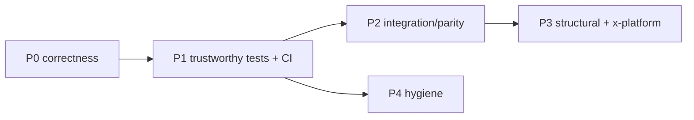

# Deliverable 5: Actionable Stabilization Roadmap (Refreshed — 2026-05-28)

> Supersedes prior roadmaps. Ordered by **return-on-effort**: fix what is silently broken
> first, then make the suite trustworthy, then pay down structural debt. Each item is a
> ready-to-file issue with acceptance criteria. Effort: S (<½ day), M (1–3 days), L (1–2 weeks).

---

## P0 — Stop-the-bleeding (correctness; small, high-impact)

| ID | Effort | Task | Acceptance criteria |
|----|--------|------|---------------------|
| P0-1 | S | Fix UI→E4 call (`controller.py:258-262`): use `StreamE4(e4=address, root_output_folder=…, synchronized_start_time=…)` or align signatures. | Connecting an E4 from the UI starts a streamer without `TypeError`; covered by a controller test. |
| P0-2 | S | Remove import-time execution in `data_processor.py:606-607`; move under `if __name__ == "__main__":` with argparse path. | `import data_processor` succeeds anywhere; `tests/test_data_processor.py` collects and runs. |
| P0-3 | S | Make Windows-only imports/launches conditional: guard `import wmi` (`main.py:14`) behind `platform.system()=='Windows'`; cross-platform event-logger launch (replace `start cmd /k`). | `python -c "import main"` succeeds on Linux/macOS; CLI starts on all 3 OSes. |
| P0-4 | S | Fix CLI hang: pass a timeout / break when `start_streaming()` returns False instead of unconditional `connected_event.wait()` (`main.py:113-114,183`). | A failed device connect returns control to the menu within the timeout. |
| P0-5 | S | Fix `stream_muse.py:310` thread target (wrap in lambda/partial); cap or remove per-sample `Timer` (`:250-251`). | Monitor thread runs; no unbounded thread growth (assert thread count stable in a timed test). |

## P1 — Make the test suite trustworthy (unblocks everything else)

| ID | Effort | Task | Acceptance criteria |
|----|--------|------|---------------------|
| P1-1 | M | Resolve coverage deadlock: configure `coverage` for multiprocessing (`concurrency=multiprocessing`, `sigterm`) or inject a fake Process in streamer tests; add `--timeout` to default pytest config. | `pytest --cov` over the whole suite completes < 90s and emits a TOTAL. |
| P1-2 | M | Add a `test_bitalino_streaming.py` and meaningful `recorder` tests; raise `recorder`, `stream_bitalino` off 0%. | Each streamer + recorder has ≥1 behavioral test; suite still green. |
| P1-3 | S | Add CI (GitHub Actions): install `requirements.txt`, run `pytest` with timeout on Linux (and Windows runner for device paths). | CI runs on push/PR; required to merge. |
| P1-4 | S | Add `requirements-lock.txt` (`pip freeze`) and run `pip-audit` in CI. | Reproducible install; CVE report visible in CI. |

## P2 — Integration & feature parity

| ID | Effort | Task | Acceptance criteria |
|----|--------|------|---------------------|
| P2-1 | M | Wire BITalino into the CLI (`main.py`) for parity with the UI, or explicitly document CLI scope. | CLI can discover/stream BITalino, or README states the limitation. |
| P2-2 | M | Replace fake UI signal-quality (92/87/85) with a real metric or an explicit "demo" badge. | UI shows measured quality, or clearly labels placeholder. |
| P2-3 | S | Integrate event logging into the app lifecycle instead of a detached Windows console; de-duplicate `event_logger.py`/`stream_info.py` into one module. | One marker-logging module, launchable cross-platform, sharing session state. |
| P2-4 | M | Add an LSL availability/health check before record/view; surface a clear error instead of silent failure. | Recording without an LSL stream produces a user-visible, tested error. |

## P3 — Structural debt & cross-platform

| ID | Effort | Task | Acceptance criteria |
|----|--------|------|---------------------|
| P3-1 | M | Extract a hardware-config layer for E4 (env-driven server path, no `D:/…` literal); document `E4_API_KEY` + server setup. | No hardcoded device paths; E4 server location configurable. |
| P3-2 | L | Decompose `ui/streamsense_ui.py`: move `Colors`→`ui/theme.py`, extract `DeviceCard`/`StreamWidget`/`LSLMonitorThread`, centralize stylesheets. | UI file < 300 LOC; styles defined once; UI smoke test passes. |
| P3-3 | M | Reduce `time.sleep()`-based synchronization in favor of events/queues where feasible. | Core sleep count materially reduced; streamers still pass tests. |
| P3-4 | S | 🔐 **Rotate the E4 API key** (it remains in git history) and document rotation. | New key issued; old key invalidated. |

## P4 — Repository hygiene (read-only audit *recommends*; do not auto-delete)

| ID | Effort | Task |
|----|--------|------|
| P4-1 | S | Archive/remove dead code: `archive/*`, `helper/plot_helper.py` stub, `scripts/capture_screenshots_headless.py`. |
| P4-2 | S | De-duplicate audit artifacts: delete `audit/feature_map.json` & `audit/project_manifest.csv` (byte-identical to `deliverables/`), or replace with pointers. |
| P4-3 | S | Move `Logs/Slide20-27.JPG` to `experiments/assets/`; stop committing empty `Logs/*.log`; regenerate or dedupe `docs/screenshots/*` (09==10). |

---

## Suggested sequence

**Headline:** 5 small P0 fixes remove 3 "Broken" statuses and a hang. P1 then makes regressions
visible. Everything after is incremental and safe once CI + coverage are trustworthy.

---

## Stabilization Progress — P0 applied 2026-05-28 (branch `claude/determined-gates-Zkfw7`)

| ID | Status | What changed |
|----|--------|--------------|
| P0-1 | ✅ Done | `ui/streamsense_controller.py` now calls `StreamE4(e4=…, root_output_folder=…, synchronized_start_time=…)`. Locked by `tests/test_import_safety.py::test_stream_e4_constructor_signature_contract`. |
| P0-2 | ✅ Done | `data_processor.py` module-level run moved behind `main()`/`if __name__=="__main__"`. `tests/test_data_processor.py` now collects + passes (was ERROR). |
| P0-3 | ✅ Done | `main.py`: `import wmi` guarded (`None` off-Windows) + E4 flow skips gracefully; event-logger launch is cross-platform (`start cmd /k` only on win32, `start_new_session` on POSIX). |
| P0-4 | ✅ Done | `main.py` Muse + E4 loops use the `start_streaming()` bool return instead of the unconditional `connected_event.wait()` that hung on failure. |
| P0-5 | ✅ Done | `streamer/stream_muse.py:310` thread target fixed (`target=…, args=(…)`, daemon); per-sample eviction `Timer` daemonized + `ValueError`-guarded. |
| (bonus) | ✅ Done | Two latent `detect_gaps` bugs surfaced by P0-2 fixed: pandas≥2.0 `Series.replace(method=…)` removal, and the seq-id-0 marker being mis-flagged as a gap. |

**Verification:** full per-file suite = **112 passed, 7 skipped, 0 failures/errors** (was 107 passed + 1 errored file). No regressions in streamer/UI tests.

## Stabilization Progress — P1 applied 2026-05-28

| ID | Status | What changed |
|----|--------|--------------|
| P1-1 | ✅ Done | **Coverage deadlock fixed** via a unit/integration split: `tests/test_base_streamer.py`, `test_e4_streaming.py`, `test_stream_recorder.py` marked `integration` (`pytest.ini`); coverage runs `pytest -m "not integration" --cov=…`. Added `.coveragerc` + `pytest.ini` (default `--timeout` backstop). Coverage now completes in ~5s at **21%** (was an indefinite hang). |
| P1-1b | ✅ Done | **Whole-suite shutdown hang fixed** at the root: an autouse reaper fixture in `tests/conftest.py` terminates stray `multiprocessing` children after each test (a leaked streamer worker had blocked the atexit join). Full suite now exits cleanly: **112 passed, 7 skipped, EXIT 0**. |
| P1-3 | ✅ Done | **CI added**: `.github/workflows/tests.yml` (ubuntu, py3.10/3.11): unit+coverage, integration pass/fail, and an advisory `pip-audit` job. Install recipe validated in a clean venv. |
| P1-4 | ✅ Done | **`requirements-dev.txt`** added (CI-installable test stack) and validated by a fresh-venv install + run. Surfaced a pin discrepancy: the working stack is numpy 2.x / pandas 3.x, *newer* than `requirements.txt` (`numpy<2.0`, `pandas<3.0`) — reconcile next. |
| P1-2 | ⬜ Open | Still need real tests for `stream_bitalino` (0%, no file) and `recorder` (1 trivial test). |

**Still open:** P1-2 (BITalino/recorder tests), reconcile `requirements.txt` numpy/pandas pins with reality, P2 (BITalino-in-CLI, real signal quality, event-logger integration, LSL health check), P3 (E4 config layer, UI decomposition, sleep→event, **rotate the E4 key still in git history**), P4 (hygiene). The UI→E4 and CLI off-Windows fixes are not runtime-verified here (PyQt5/pygatt/psychopy absent); covered by code review + the signature-contract test, and will run in CI on a Windows runner if added.
