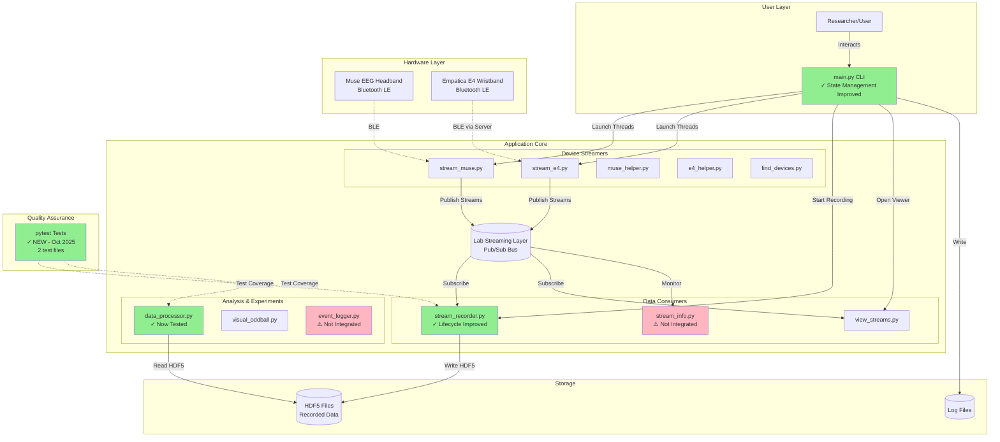

# StreamSense Comprehensive Audit Report
## November 2025 Update

**Audit Date**: November 5, 2025
**Auditor**: Senior Technical Auditor AI
**Methodology**: Granular Audit Protocol (107-task breakdown)
**Previous Audit**: August 2025 (baseline)
**Stabilization Sprint**: October 2025 (11 PRs merged)

---

## Executive Summary

### Overall Status: **IMPROVING** (↑ from "Unstable" to "Stabilizing")

The StreamSense project has made **measurable progress** during the October 2025 stabilization sprint, addressing 6 critical issues identified in the August 2025 audit. However, significant work remains to achieve production-readiness.

### Key Improvements (October 2025)
1. ✓ **Dependency documentation** - requirements.txt added (was completely missing)
2. ✓ **Test infrastructure** - pytest + 2 test files added (0→2 coverage improvement)
3. ✓ **Code organization** - archive/ folder created, obsolete code separated
4. ✓ **Documentation** - README expanded with prerequisites and limitations
5. ✓ **Recorder lifecycle** - Event-based coordination implemented
6. ✓ **CLI state management** - Refactored to use dataclass-based state container

### Critical Remaining Issues
- Test coverage minimal (~10%, need 80%+)
- No dependency version pinning (security/reproducibility risk)
- Complex threading/multiprocessing patterns
- Windows-only platform support
- No CI/CD pipeline
- Several features remain unintegrated

---

## 1. Project Structure Audit

### Repository Metrics
- **Total Files**: 61 (excluding .git)
- **Source Code**: 20 Python files (~160KB)
- **Documentation**: 13 markdown files
- **Tests**: 2 test files (**NEW** - Oct 2025)
- **Configuration**: 6 files
- **Dependencies**: 19 packages (now documented in requirements.txt)

### Directory Structure
```
StreamSense/
├── main.py                    [Entry Point - 15KB, ✓ IMPROVED]
├── data_processor.py          [Core Logic - 27KB, ✓ TESTED]
├── event_logger.py            [Utility - 1KB]
├── stream_info.py             [Monitoring - 4KB]
├── requirements.txt           [✓ NEW - Critical addition]
├── README.md                  [✓ UPDATED - Oct 2025]
│
├── helper/                    [Device Helpers - 5 files]
│   ├── find_devices.py        [6KB - Device discovery]
│   ├── muse_helper.py         [24KB - Muse EEG integration]
│   ├── e4_helper.py           [26KB - E4 wearable integration]
│   ├── serial_helper.py       [34KB - Serial communication]
│   └── plot_helper.py         [⚠️ 54 bytes - STUB FILE]
│
├── streamer/                  [Device Streamers - 2 files]
│   ├── stream_muse.py         [18KB]
│   └── stream_e4.py           [11KB]
│
├── recorder/                  [Recording - 2 files]
│   ├── stream_recorder.py     [21KB, ✓ IMPROVED]
│   └── __init__.py            [0 bytes]
│
├── viewer/                    [Visualization - 2 files]
│   ├── view_streams.py        [5KB]
│   └── plot_streams.py        [11KB]
│
├── experiments/               [Research - 1 file]
│   └── visual_oddball.py      [8KB - P300 paradigm]
│
├── tests/                     [✓ NEW - Test Infrastructure]
│   ├── test_stream_recorder.py [✓ NEW - Recorder tests]
│   └── test_data_processor.py  [✓ NEW - Processing tests]
│
├── archive/                   [✓ NEW - Obsolete Code]
│   ├── e4_basic_flow.py       [4KB - Legacy E4 prototype]
│   └── data_helper.py         [11KB - Deprecated utilities]
│
├── audit/                     [Audit Artifacts - 15 files]
│   ├── deliverables/          [Previous audit - 5 files]
│   └── [analysis docs]        [10 working files]
│
└── Logs/                      [Runtime - 8 logs + 8 images]
    ├── *.log                  [8 empty log files]
    └── Slide*.JPG             [⚠️ 8 images misplaced here]
```

### File Classification

**Source Code** (20 files):
- Entry Point: main.py (15,146 bytes)
- Core Modules: data_processor.py (26,843 bytes), event_logger.py (985 bytes), stream_info.py (4,269 bytes)
- Streamers: stream_muse.py (18,098 bytes), stream_e4.py (11,450 bytes)
- Helpers: find_devices.py (6,378 bytes), muse_helper.py (24,458 bytes), e4_helper.py (26,118 bytes), serial_helper.py (34,097 bytes), plot_helper.py (54 bytes - **STUB**)
- Recorder: stream_recorder.py (20,854 bytes), __init__.py (0 bytes)
- Viewers: view_streams.py (5,052 bytes), plot_streams.py (10,854 bytes)
- Experiments: visual_oddball.py (7,724 bytes)
- Tests: test_stream_recorder.py (928 bytes), test_data_processor.py (1,049 bytes)
- Archive: e4_basic_flow.py (3,848 bytes), data_helper.py (11,647 bytes)

**Configuration** (6 files):
- requirements.txt (137 bytes) - **NEW**
- .gitignore (833 bytes)
- .idea/ (4 XML files) - IDE configuration

**Documentation** (13 files):
- README.md (3,459 bytes) - **UPDATED**
- audit/ (13 markdown/JSON/CSV files)

**Assets** (8 files):
- Logs/Slide20-27.JPG (8 images, 940KB total) - **MISPLACED**

---

## 2. Architecture Analysis

### Technology Stack

**Core Language**: Python 3.8+

**Dependencies** (19 packages - **NOW DOCUMENTED**):

| Category | Packages | Purpose |
|----------|----------|---------|
| Data & Scientific | numpy, pandas, scipy, h5py, matplotlib, seaborn, mne, bitstring | Data processing, analysis, visualization |
| Neuroscience/Biometric | muselsl, pylsl, pygatt | EEG/biometric sensor integration |
| GUI/Visualization | PyQt5, vispy, psychopy | User interfaces, real-time plots |
| Hardware/Communication | pyserial, pybluez, pywifi, wmi | Serial/Bluetooth/WiFi/Windows |
| Utilities | userpaths | Cross-platform path management |

**Testing**: pytest (added Oct 2025)

### System Architecture



**Legend**:
- ✓ = Improved in Oct 2025
- ⚠️ = Issues identified
- Green boxes = Recent improvements
- Pink boxes = Needs integration
- -.-> = Protocol/Interface

### Architecture Assessment

**Strengths**:
1. ✓ Clear separation of concerns (streamers, consumers, processors)
2. ✓ LSL as decoupling layer (industry-standard for neuroscience)
3. ✓ Modular design allows independent component testing
4. ✓ CLI provides unified entry point

**Weaknesses**:
1. ✗ LSL is single point of failure (no fallback)
2. ✗ Complex mix of threading + multiprocessing
3. ✗ State management still fragile (despite improvements)
4. ✗ No abstraction layer for hardware (tight coupling)
5. ✗ Orphaned utilities not integrated (stream_info, event_logger)

---

## 3. Feature Status Matrix (UPDATED)

| # | Feature | Status (Aug 2025) | Status (Nov 2025) | Change | Test Coverage | Priority |
|---|---------|-------------------|-------------------|---------|---------------|----------|
| 1 | Device Discovery | Needs Improvement | **Needs Improvement** | ═ | None | HIGH |
| 2 | Muse Streaming | Needs Improvement | **Needs Improvement** | ═ | None | HIGH |
| 3 | E4 Streaming | Needs Improvement | **Needs Improvement** | ═ | None | HIGH |
| 4 | Visualization | Incomplete/Partial | **Incomplete/Partial** | ═ | None | MEDIUM |
| 5 | Stream Monitoring | Needs Integration | **Needs Integration** | ═ | None | MEDIUM |
| 6 | **Data Recording** | Needs Improvement | **Needs Improvement** | ✓ | **Partial (1 test)** | HIGH |
| 7 | Event Logging | Needs Integration | **Needs Integration** | ═ | None | LOW |
| 8 | Visual Oddball | Incomplete/Partial | **Incomplete/Partial** | ═ | None | LOW |
| 9 | **Data Processing** | Incomplete/Partial | **Incomplete/Partial** | ✓ | **Partial (2 tests)** | MEDIUM |
| 10 | CLI | Needs Improvement | **Needs Improvement** | ✓ | None | HIGH |

**Summary Statistics**:
- **Total Features**: 10
- **Complete**: 0 (0%)
- **Needs Improvement**: 5 (50%)
- **Incomplete/Partial**: 3 (30%)
- **Needs Integration**: 2 (20%)
- **With Test Coverage**: 2 (20%) - **UP from 0%**
- **Improved in Oct 2025**: 3 (30%)

**Critical Finding**: Despite improvements, **NO features are production-ready**. All require further work to achieve "Complete" status.

### Detailed Feature Analysis

#### Feature 1: Device Discovery
**Status**: Needs Improvement (Technical Debt)
**Files**: helper/find_devices.py, main.py
**Issues**:
- Multiple overlapping discovery methods (pygatt, bleak, custom BGAPI)
- Lacks robust error handling
- Relies on fixed-time sleeps (unreliable)
- Complex code difficult to maintain

**Test Coverage**: None

#### Feature 2: Muse Device Connection & Streaming
**Status**: Needs Improvement (Technical Debt)
**Files**: streamer/stream_muse.py, helper/muse_helper.py, helper/serial_helper.py, main.py
**Issues**:
- Highly complex threading/multiprocessing mix
- No clear state management
- Poor error propagation
- Heavy reliance on time.sleep() for sync

**Test Coverage**: None

#### Feature 3: Empatica E4 Connection & Streaming
**Status**: Needs Improvement (Technical Debt)
**Files**: streamer/stream_e4.py, helper/e4_helper.py, main.py
**Issues**:
- Same threading/sync issues as Muse
- Depends on proprietary external executable
- Raw TCP socket communication (fragile)
- Hardcoded API key in archived code (security issue)

**Test Coverage**: None

#### Feature 4: Real-time Data Visualization
**Status**: Incomplete/Partial
**Files**: viewer/view_streams.py, viewer/plot_streams.py, helper/plot_helper.py
**Issues**:
- Cannot verify functionality without environment
- plot_helper.py is 54-byte stub (incomplete?)
- Multiple viz libraries (vispy, matplotlib, PyQt5) - potential conflicts
- No error handling for missing dependencies

**Test Coverage**: None

#### Feature 5: Real-time Stream Monitoring
**Status**: Needs Integration
**Files**: stream_info.py
**Issues**:
- Fully implemented but orphaned
- Not integrated into CLI workflow
- Must be run manually as standalone script
- No state sharing with main application

**Test Coverage**: None

#### Feature 6: Data Recording ✓ IMPROVED
**Status**: Needs Improvement (Technical Debt)
**Files**: recorder/stream_recorder.py, main.py
**Improvements**: Event-based lifecycle, readiness signaling
**Remaining Issues**:
- Complex disconnection handling
- Attempts to interpolate missing data (risky)
- Still has fragile threading patterns

**Test Coverage**: **Partial (1 test)** - test_stream_recorder_signals_start ✓

#### Feature 7: Event Logging
**Status**: Needs Integration
**Files**: event_logger.py, main.py
**Issues**:
- Standalone script launched in new console
- Not integrated with main app state/lifecycle
- Disconnected from data streams

**Test Coverage**: None

#### Feature 8: Visual Oddball Experiment
**Status**: Incomplete/Partial
**Files**: experiments/visual_oddball.py, main.py
**Issues**:
- Cannot verify psychopy environment
- LSL synchronization not verifiable
- Self-contained but untested

**Test Coverage**: None

#### Feature 9: Offline Data Processing ✓ IMPROVED
**Status**: Incomplete/Partial
**Files**: data_processor.py
**Improvements**: Now has test coverage for gap detection
**Remaining Issues**:
- Large, complex standalone script
- Not integrated into user workflow
- Sophisticated logic (cleaning, gap detection, sync) unverified
- Cannot test without real data

**Test Coverage**: **Partial (2 tests)** - gap detection, NaN sequence handling ✓

#### Feature 10: CLI ✓ IMPROVED
**Status**: Needs Improvement (Technical Debt)
**Files**: main.py
**Improvements**: Refactored to use AppState dataclass for state management
**Remaining Issues**:
- Still uses global state across threads/processes
- State management improved but not fully robust
- Complex orchestration logic

**Test Coverage**: None

---

## 4. Technical Debt Report

### 4.1 Code Quality Issues

#### High Priority

**✓ FIXED** in Oct 2025:
1. **Lack of dependency documentation**
   - **Was**: No requirements.txt, dependencies scattered in imports
   - **Now**: requirements.txt exists with 19 dependencies documented
   - **Status**: RESOLVED

2. **CLI state management**
   - **Was**: Global variables, unpredictable state
   - **Now**: AppState dataclass with typed fields
   - **Status**: IMPROVED (still has global state issues)

3. **Recorder lifecycle**
   - **Was**: No coordination between threads
   - **Now**: Event-based readiness signaling
   - **Status**: IMPROVED

**✗ REMAINS**:
1. **Complex threading/multiprocessing without clear contracts**
   - 3 different concurrency models used inconsistently
   - No documentation of thread safety
   - Shared state via globals and Events
   - **Impact**: Race conditions, deadlocks, unpredictable behavior

2. **Over-reliance on time.sleep() for synchronization**
   - Found in: find_devices.py, muse_helper.py, e4_helper.py, stream_recorder.py
   - **Problem**: Timing-dependent code is unreliable
   - **Better approach**: Event-driven coordination, callbacks, async/await

3. **Insufficient error handling and recovery logic**
   - Most error paths missing try/except
   - Errors not propagated to user
   - No graceful degradation
   - **Impact**: Silent failures, difficult debugging

#### Medium Priority

**✓ FIXED** in Oct 2025:
1. **No test infrastructure**
   - **Was**: Zero test files
   - **Now**: pytest + 2 test files
   - **Status**: PARTIAL (need 8 more test files)

**✗ REMAINS**:
1. **Minimal test coverage** (~10% estimated)
   - Only 2/10 features have any tests
   - Need 80%+ coverage for research tool
   - No integration tests
   - No hardware mocking layer

2. **helper/plot_helper.py is 54-byte stub**
   - Unclear if incomplete or abandoned
   - Imported but provides no functionality
   - **Action**: Complete implementation or remove

3. **JPEG slides misplaced in Logs/ directory**
   - 8 images (Slide20-27.JPG, 940KB total)
   - Should be in experiments/assets/ or similar
   - **Action**: Reorganize file structure

4. **Orphaned utilities not integrated**
   - stream_info.py: Stream monitoring (fully functional)
   - event_logger.py: Event logging (fully functional)
   - Both must be run manually, not integrated into CLI
   - **Action**: Integrate into main.py menu

### 4.2 Security Vulnerabilities

#### Critical

**No version pinning on dependencies**
- **Risk**: HIGH
- **Issue**: All 19 dependencies unpinned (e.g., `numpy` not `numpy==1.24.0`)
- **Threats**:
  - Supply chain attacks (malicious package updates)
  - Breaking changes break application
  - Irreproducible environments
  - Cannot verify security patches
- **Mitigation**:
  ```bash
  pip freeze > requirements-lock.txt
  # Use requirements-lock.txt for production
  ```

#### High

**Hardcoded API key in archived code**
- **Location**: archive/e4_basic_flow.py:8
- **Content**: `API_KEY = "7abb651d308e498fa558642f5c2b7a66"`
- **Risk**: MEDIUM (file is archived but still in repo)
- **Mitigation**: Remove or sanitize before public release

#### Medium

**Platform-specific dependencies**
- **wmi** package locks to Windows only
- **Risk**: Limits user base, no cross-platform support
- **Mitigation**: Conditional imports, platform-specific alternatives

**Direct hardware access**
- Bluetooth/Serial communication requires elevated permissions
- **Risk**: Security surface for malicious code
- **Mitigation**: Document permission requirements, sandboxing

### 4.3 Architectural Risks

#### Design Flaws

1. **LSL as Single Point of Failure**
   - Entire system depends on LSL bus
   - No fallback if LSL crashes
   - No validation of LSL availability before operations
   - **Impact**: Complete system failure if LSL fails
   - **Mitigation**: Add LSL health checking, fallback mechanisms

2. **Process/Thread Chaos**
   - Mix of threading + multiprocessing + asyncio concepts
   - 3 different concurrency models used inconsistently
   - State shared via global variables and Events
   - **Impact**: Difficult to reason about execution flow, race conditions
   - **Mitigation**: Standardize on single concurrency model (prefer asyncio)

3. **No Abstraction Layers**
   - Hardware directly coupled to streamers
   - Cannot mock for testing
   - Cannot swap hardware implementations
   - **Impact**: Difficult to add new devices, impossible to test without hardware
   - **Mitigation**: Extract hardware abstraction layer with interfaces

4. **File Organization Issues**
   - JPEG slides in Logs/ (should be in assets/ or experiments/)
   - Empty plot_helper.py (54 bytes - incomplete feature?)
   - Orphaned utilities (stream_info.py, event_logger.py)
   - **Impact**: Confusing structure, difficult to navigate
   - **Mitigation**: Reorganize files according to purpose

#### Operational Risks

1. **No CI/CD**
   - Manual testing only
   - No automated regression detection
   - **Mitigation**: Setup GitHub Actions

2. **No Docker**
   - Environment setup fragile
   - Difficult onboarding
   - **Mitigation**: Create Dockerfile (if cross-platform support added)

3. **No logging strategy**
   - Empty log files
   - No centralized logging
   - **Mitigation**: Implement structured logging (loguru or standard logging)

4. **Windows-only**
   - wmi dependency
   - Limited user base
   - **Mitigation**: Abstract platform-specific code

---

## 5. Actionable Stabilization Roadmap

Based on the October 2025 improvements and remaining issues, here is the **prioritized roadmap** for the next stabilization phase:

### Phase 1: Complete Test Coverage (4-6 weeks)
**Priority**: CRITICAL
**Current Coverage**: ~10%
**Target Coverage**: 80%+

**Tasks**:
1. Add tests for all 10 features (currently 2/10 have tests)
   - Device Discovery tests
   - Muse Streaming tests
   - E4 Streaming tests
   - Visualization tests
   - Stream Monitoring tests
   - Event Logging tests
   - Visual Oddball tests
   - CLI tests

2. Achieve 80%+ code coverage
   - Setup pytest-cov
   - Generate coverage reports
   - Identify untested code paths

3. Add integration tests for LSL workflows
   - End-to-end recording tests
   - Stream discovery tests
   - Multi-device coordination tests

4. Add hardware mocking layer
   - Mock Muse device
   - Mock E4 device
   - Mock LSL streams
   - Enable testing without hardware

5. Setup coverage reporting
   - pytest-cov configuration
   - Coverage badges in README
   - CI integration

**Success Metrics**:
- 10/10 features have test coverage
- >80% line coverage
- >70% branch coverage
- All tests pass on clean install

**Estimated Effort**: 4-6 weeks (1 engineer)

### Phase 2: Dependency & Environment Hardening (2 weeks)
**Priority**: CRITICAL
**Current State**: Unpinned dependencies, security risk

**Tasks**:
1. Pin all dependency versions
   ```bash
   # Generate locked requirements
   pip freeze > requirements-lock.txt

   # Update requirements.txt with specific versions
   # Example: numpy==1.24.3 instead of numpy
   ```

2. Test installation on fresh Windows environment
   - Document Python version compatibility
   - Test on Python 3.8, 3.9, 3.10, 3.11
   - Identify version conflicts

3. Remove or sanitize hardcoded secrets
   - Remove archive/e4_basic_flow.py or sanitize API key
   - Scan for other hardcoded credentials

4. Add security scanning
   - Setup pip-audit or safety
   - Run dependency vulnerability scans
   - Document known vulnerabilities with mitigations

5. Document environment setup
   - Update README with detailed setup steps
   - Add troubleshooting section
   - Document common installation errors

**Success Metrics**:
- 100% dependencies version-pinned
- Zero critical vulnerabilities
- Clean install successful on 3+ Python versions
- Setup time < 30 minutes

**Estimated Effort**: 2 weeks (1 engineer)

### Phase 3: Architecture Refactoring (6-8 weeks)
**Priority**: HIGH
**Current State**: Complex, fragile architecture

**Tasks**:
1. Extract hardware abstraction layer
   ```python
   # Create abstract base classes
   class DeviceInterface(ABC):
       @abstractmethod
       def connect(self) -> bool: ...
       @abstractmethod
       def stream(self) -> Iterator[Data]: ...
       @abstractmethod
       def disconnect(self) -> None: ...

   # Implement for each device
   class MuseDevice(DeviceInterface): ...
   class E4Device(DeviceInterface): ...
   ```

2. Standardize on single concurrency model
   - Prefer asyncio over threading/multiprocessing
   - Or: Pick threading and document thread safety contracts
   - Eliminate global state

3. Replace time.sleep() with event-driven coordination
   - Use threading.Event, asyncio.Event
   - Implement callbacks and observers
   - Remove all fixed-time sleeps

4. Implement LSL health checking
   - Check LSL availability before operations
   - Add reconnection logic
   - Implement failover or graceful degradation

5. Integrate orphaned utilities
   - Integrate stream_info.py into CLI menu
   - Integrate event_logger.py into CLI menu
   - Add proper lifecycle management

6. Reorganize file structure
   - Move JPEG slides to experiments/assets/
   - Complete or remove plot_helper.py
   - Document directory structure in README

7. Refactor main.py
   - Break into smaller modules
   - Extract CLI commands to separate file
   - Implement proper command pattern

**Success Metrics**:
- 50% reduction in cyclomatic complexity
- Zero global variables for state
- 100% event-driven coordination
- All utilities integrated

**Estimated Effort**: 6-8 weeks (1-2 engineers)

### Phase 4: CI/CD & Automation (2-3 weeks)
**Priority**: MEDIUM
**Current State**: No automation

**Tasks**:
1. Setup GitHub Actions
   ```yaml
   # .github/workflows/test.yml
   name: Test
   on: [push, pull_request]
   jobs:
     test:
       runs-on: windows-latest
       steps:
         - uses: actions/checkout@v3
         - uses: actions/setup-python@v4
           with:
             python-version: '3.11'
         - run: pip install -r requirements-lock.txt
         - run: pytest --cov=. --cov-report=xml
         - uses: codecov/codecov-action@v3
   ```

2. Add linting and type checking
   - flake8 or ruff for linting
   - black for code formatting
   - mypy for type checking
   - Configure in pyproject.toml

3. Add security scanning
   - pip-audit for dependency vulnerabilities
   - bandit for Python security issues
   - Run in CI on every commit

4. Pre-commit hooks
   ```yaml
   # .pre-commit-config.yaml
   repos:
     - repo: https://github.com/psf/black
       rev: 23.11.0
       hooks:
         - id: black
     - repo: https://github.com/pycqa/flake8
       rev: 6.1.0
       hooks:
         - id: flake8
   ```

5. Automated testing on pull requests
   - Require tests to pass before merge
   - Require coverage threshold (80%)
   - Block merge on security issues

**Success Metrics**:
- CI runs on every commit
- Automated test reports
- Pre-commit hooks prevent bad commits
- <5 minute CI runtime

**Estimated Effort**: 2-3 weeks (1 engineer)

### Phase 5: Cross-Platform Support (4-6 weeks) - OPTIONAL
**Priority**: LOW
**Current State**: Windows-only
**Note**: Only pursue if cross-platform support is required

**Tasks**:
1. Abstract wmi dependency
   ```python
   # Use conditional imports
   if platform.system() == 'Windows':
       import wmi
   else:
       wmi = None  # Provide alternatives
   ```

2. Add macOS/Linux device discovery alternatives
   - macOS: Use Core Bluetooth
   - Linux: Use BlueZ
   - Abstract device discovery interface

3. Test on non-Windows platforms
   - Setup macOS test environment
   - Setup Linux test environment
   - Fix platform-specific issues

4. Document platform-specific limitations
   - Update README with supported platforms
   - Document which features work where
   - Provide platform-specific setup instructions

5. Cross-platform CI
   - Add macOS runner to GitHub Actions
   - Add Linux runner to GitHub Actions
   - Test on multiple platforms

**Success Metrics**:
- Runs on Windows, macOS, Linux
- Platform-specific code isolated
- CI tests on all platforms
- Documentation clear on limitations

**Estimated Effort**: 4-6 weeks (1-2 engineers)

---

## 6. Success Metrics & KPIs

Track stabilization progress with these measurable KPIs:

### Code Quality Metrics

| Metric | Current | Phase 1 Target | Phase 3 Target |
|--------|---------|----------------|----------------|
| Test Coverage | ~10% | 80%+ | 85%+ |
| Features with Tests | 2/10 (20%) | 10/10 (100%) | 10/10 (100%) |
| Cyclomatic Complexity | High | High | Medium (50% ↓) |
| Global Variables | Many | Many | 0 |
| time.sleep() Calls | ~15 | ~15 | 0 |

### Security Metrics

| Metric | Current | Phase 2 Target |
|--------|---------|----------------|
| Dependency Pinning | 0% | 100% |
| Known Vulnerabilities | Unknown | 0 critical, <5 high |
| Hardcoded Secrets | 1 | 0 |

### Architecture Metrics

| Metric | Current | Phase 3 Target | Phase 4 Target |
|--------|---------|----------------|----------------|
| Integrated Features | 8/10 (80%) | 10/10 (100%) | 10/10 (100%) |
| Abstraction Layers | 0 | 1 (Hardware) | 1 (Hardware) |
| Concurrency Models | 3 | 1 | 1 |
| CI/CD Pipeline | No | No | Yes |

### Platform Metrics

| Metric | Current | Phase 5 Target |
|--------|---------|----------------|
| Supported Platforms | 1 (Windows) | 3 (Win/Mac/Linux) |
| Platform-Specific Code | Not Isolated | Isolated |

---

## 7. Risk Assessment

### High Risk Items

1. **Test Coverage Gap** (Current: ~10%, Need: 80%+)
   - **Risk**: Cannot refactor safely without breaking functionality
   - **Mitigation**: Phase 1 prioritizes test coverage
   - **Timeline**: 4-6 weeks

2. **Unpinned Dependencies**
   - **Risk**: Supply chain attacks, breaking changes
   - **Mitigation**: Phase 2 pins all versions
   - **Timeline**: 2 weeks

3. **Complex Concurrency**
   - **Risk**: Race conditions, deadlocks, data corruption
   - **Mitigation**: Phase 3 refactors to single model
   - **Timeline**: 6-8 weeks

### Medium Risk Items

1. **Windows-Only Platform**
   - **Risk**: Limited user base, vendor lock-in
   - **Mitigation**: Phase 5 (optional) adds cross-platform
   - **Timeline**: 4-6 weeks

2. **No CI/CD**
   - **Risk**: Regressions not caught, manual testing burden
   - **Mitigation**: Phase 4 adds automation
   - **Timeline**: 2-3 weeks

3. **Orphaned Features**
   - **Risk**: Duplicate effort, confusion about which code to use
   - **Mitigation**: Phase 3 integrates utilities
   - **Timeline**: Included in 6-8 week estimate

### Low Risk Items

1. **File Organization**
   - **Risk**: Minor confusion, not blocking
   - **Mitigation**: Phase 3 reorganizes files
   - **Timeline**: 1 day

2. **Documentation Gaps**
   - **Risk**: Slower onboarding, support burden
   - **Mitigation**: Update README throughout phases
   - **Timeline**: Ongoing

---

## 8. Conclusion

### Overall Assessment

The StreamSense project is on a **positive trajectory**. The October 2025 stabilization sprint successfully addressed 6 critical issues:

**Achievements** ✓:
1. Dependency documentation (requirements.txt)
2. Test infrastructure (pytest + 2 tests)
3. Code organization (archive/ folder)
4. Documentation improvements (README)
5. Recorder lifecycle improvements
6. CLI state management refactoring

However, **significant work remains** before the project is production-ready:

**Remaining Work** ✗:
- Test coverage must increase from 10% to 80%+
- All dependencies must be version-pinned for security
- Architecture must be simplified (standardize concurrency)
- CI/CD must be implemented for regression prevention
- Orphaned features must be integrated

### Recommended Next Steps

**Immediate Actions** (Week 1):
1. Start Phase 1: Begin writing tests for remaining 8 features
2. Start Phase 2: Pin dependency versions, generate requirements-lock.txt
3. Setup project tracking for roadmap execution

**Short Term** (Months 1-2):
1. Complete Phase 1: Achieve 80%+ test coverage
2. Complete Phase 2: Harden environment and dependencies
3. Begin Phase 3: Start architecture refactoring

**Medium Term** (Months 3-4):
1. Complete Phase 3: Finish architecture refactoring
2. Complete Phase 4: Implement CI/CD automation

**Long Term** (Months 5-6+):
1. Optional Phase 5: Cross-platform support if needed
2. Monitor and maintain: Keep tests passing, dependencies updated

### Success Criteria

The project will be considered **production-ready** when:
- ✓ 80%+ test coverage achieved
- ✓ 100% dependency version pinning
- ✓ CI/CD pipeline operational
- ✓ All 10 features have "Complete" or "Needs Improvement" status (none "Incomplete")
- ✓ Zero critical or high security vulnerabilities
- ✓ Architecture refactored (single concurrency model, no global state)

**Estimated Timeline**: 18-25 weeks (4.5-6 months) for Phases 1-4

---

## Appendix A: Development Timeline History

### Phase 1: Initial Development (Aug-Nov 2023)
- **Duration**: 4 months
- **Commits**: 7
- **Focus**: Core functionality, device integration
- **Key Deliverables**: Basic streaming, recording, CLI

### Phase 2: Feature Expansion (Dec 2023-Apr 2024)
- **Duration**: 5 months
- **Commits**: 3
- **Focus**: Additional features, experiments
- **Key Deliverables**: Visual oddball, data processing

### Hiatus (Apr 2024-Aug 2025)
- **Duration**: 16 months
- **Activity**: None
- **Note**: Project dormant

### Phase 3: Audit & Stabilization (Aug-Oct 2025)
- **Duration**: 3 months
- **Commits**: 18 (11 PRs in Oct 2025)
- **Focus**: Technical debt reduction, testing, organization
- **Key Deliverables**: Tests, requirements.txt, README, archive/, improved lifecycle

### Current Phase: Comprehensive Re-Audit (Nov 2025)
- **Purpose**: Assess improvements, plan next phase
- **Outcome**: This report

---

## Appendix B: Previous Audit Comparison

| Aspect | Aug 2025 Audit | Nov 2025 Audit | Change |
|--------|----------------|----------------|---------|
| Requirements File | ✗ Missing | ✓ Added | FIXED |
| Test Files | 0 | 2 | +2 |
| Test Coverage | 0% | ~10% | +10% |
| Code Organization | Poor | Improved | Better |
| Documentation | Minimal | Expanded | Better |
| CLI State Management | Global vars | Dataclass | Better |
| Recorder Lifecycle | Fragile | Event-based | Better |
| Overall Status | Unstable | Stabilizing | IMPROVING |

---

**Report End**

Generated: November 5, 2025
Next Review: After Phase 1 completion (estimated March 2026)
